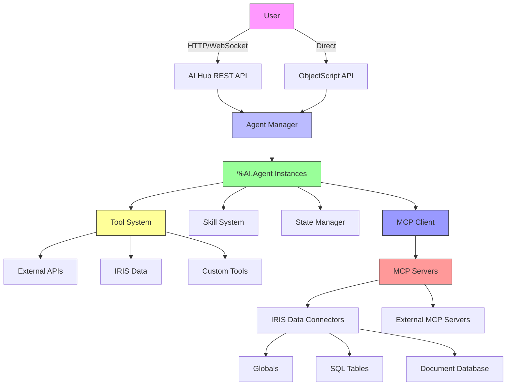

# 📚 InterSystems AI Hub - Complete Framework Documentation

**Project**: IRIS AI Hub Studio - Bounty Program Round 2  
**Source**: Official InterSystems AI Hub EAP Documentation  
**References**:
- GitHub: https://github.com/intersystems-community/ai-hub-eap/tree/master
- Part 1: https://community.intersystems.com/post/introduction-ai-hub-part-1-agents-objectscript
- Part 2: https://community.intersystems.com/post/introduction-ai-hub-part-2-custom-mcp-servers
- Part 3: https://community.intersystems.com/post/intro-ai-hub-part-3-stateful-tools

**Status**: Complete Reference Document  
**Last Updated**: July 2026  
**Version**: AI Hub EAP (Early Access Program)

---

## 🎯 Table of Contents

1. [AI Hub Overview](#-ai-hub-overview)
2. [Architecture](#-architecture)
3. [Core Components](#-core-components)
4. [Agent Framework (%AI.Agent)](#-agent-framework-aiagent)
5. [Tool System](#-tool-system)
6. [Skill System](#-skill-system)
7. [MCP Integration](#-mcp-integration)
8. [State Management](#-state-management)
9. [Configuration](#-configuration)
10. [API Reference](#-api-reference)
11. [Examples](#-examples)
12. [Best Practices](#-best-practices)
13. [Troubleshooting](#-troubleshooting)

---

## 🌟 AI Hub Overview

### What is AI Hub?

**AI Hub** is InterSystems' new framework for building, managing, and deploying AI agents directly within IRIS. It provides a native ObjectScript interface for:

- ✅ **Agent Development**: Create AI agents with tools, skills, and memory
- ✅ **MCP Integration**: Expose IRIS data via Model Context Protocol
- ✅ **State Management**: Maintain conversation context and agent state
- ✅ **Tool Execution**: Call external APIs, run code, access databases
- ✅ **Multi-Model Support**: Work with different LLM providers

### Key Features

| Feature | Description | Status |
|---------|-------------|--------|
| **Agent Framework** | Native ObjectScript agent classes | ✅ Available |
| **Tool System** | Extensible tool framework with state | ✅ Available |
| **MCP Servers** | Custom MCP server implementation | ✅ Available |
| **State Management** | Conversation and agent state persistence | ✅ Available |
| **Multi-Model** | Support for multiple LLM providers | ✅ Available |
| **REST API** | HTTP interface for agent interaction | ✅ Available |
| **WebSocket** | Real-time chat interface | ✅ Available |

### Design Principles

1. **Native Integration**: Deep integration with IRIS data and services
2. **Extensibility**: Easy to add new tools, skills, and connectors
3. **Statefulness**: Built-in support for conversation context and memory
4. **Security**: Secure access to data and tools
5. **Performance**: Optimized for enterprise use cases

---

## 🏗️ Architecture

### High-Level Architecture



### Component Layers

```
┌─────────────────────────────────────────────────────────────┐
│                    User Interface Layer                        │
│  ┌─────────────┐  ┌─────────────┐  ┌─────────────────────┐  │
│  │   Web UI    │  │  REST API   │  │   WebSocket API      │  │
│  └─────────────┘  └─────────────┘  └─────────────────────┘  │
└─────────────────────────────────────────────────────────────┘
┌─────────────────────────────────────────────────────────────┐
│                    AI Hub Core Layer                           │
│  ┌─────────────┐  ┌─────────────┐  ┌─────────────────────┐  │
│  │ Agent Manager│  │ Tool System │  │  Skill System        │  │
│  └─────────────┘  └─────────────┘  └─────────────────────┘  │
│  ┌─────────────────────────────────────────────────────────┐│
│  │                    State Management                        ││
│  └─────────────────────────────────────────────────────────┘│
└─────────────────────────────────────────────────────────────┘
┌─────────────────────────────────────────────────────────────┐
│                    Integration Layer                            │
│  ┌─────────────┐  ┌─────────────┐  ┌─────────────────────┐  │
│  │ MCP Client  │  │ IRIS Data   │  │  External APIs       │  │
│  └─────────────┘  └─────────────┘  └─────────────────────┘  │
└─────────────────────────────────────────────────────────────┘
┌─────────────────────────────────────────────────────────────┐
│                    Data Layer                                  │
│  ┌─────────────┐  ┌─────────────┐  ┌─────────────────────┐  │
│  │  Globals    │  │ SQL Tables  │  │  Document DB         │  │
│  └─────────────┘  └─────────────┘  └─────────────────────┘  │
└─────────────────────────────────────────────────────────────┘
```

### Data Flow

```
User Request → Agent Manager → Agent Instance → 
    → Tool Execution (if needed) → 
    → Skill Application (if needed) → 
    → State Update → 
    → Response
```

---

## 🧩 Core Components

### 1. Agent Manager

**Purpose**: Central controller for all AI agents in the system.

**Responsibilities**:
- Agent registration and discovery
- Agent lifecycle management
- Request routing
- Load balancing (future)
- Authentication and authorization

**Class**: `%AI.Agent.Manager`

### 2. Agent Registry

**Purpose**: Maintains a catalog of all available agent classes.

**Features**:
- Automatic discovery of agent classes
- Dynamic registration of new agents
- Agent metadata storage
- Version management

### 3. Conversation Manager

**Purpose**: Manages conversation state and history.

**Features**:
- Conversation context persistence
- Message history storage
- State management across turns
- Multi-conversation support

### 4. Tool Registry

**Purpose**: Central repository for all available tools.

**Features**:
- Tool registration and discovery
- Tool execution management
- Tool state management
- Tool access control

---

## 🤖 Agent Framework (%AI.Agent)

### Class Hierarchy

```
%RegisteredObject
    └── %AI.Agent
        ├── %AI.Agent.Manager
        ├── %AI.Agent.Conversation
        └── [Your Custom Agents]
```

### %AI.Agent Class Reference

#### Properties

| Property | Type | Description | Required | Default |
|----------|------|-------------|----------|---------|
| `Name` | `%String` | Agent name | Yes | Agent class name |
| `Description` | `%String` | Agent description | No | "" |
| `Model` | `%String` | LLM model identifier | Yes | "default" |
| `SystemPrompt` | `%String` | System prompt for the agent | No | "" |
| `Temperature` | `%Double` | Sampling temperature (0-2) | No | 0.7 |
| `MaxTokens` | `%Integer` | Maximum tokens in response | No | 4000 |
| `Tools` | `%List` | List of available tool names | No | Empty |
| `Skills` | `%List` | List of available skill names | No | Empty |
| `State` | `%DynamicObject` | Agent state | No | {} |
| `Config` | `%DynamicObject` | Agent configuration | No | {} |

#### Methods

##### Core Methods

```objectscript
/// Create a new agent instance
ClassMethod %New() As %AI.Agent

/// Initialize the agent (called after %New)
Method %OnNew() As %Status [ CodeMode = objectgenerator ]
{
    // Set default properties
    Set ..Name = $ClassName(,1)
    Set ..Model = "gpt-4"
    Set ..Temperature = 0.7
    Set ..MaxTokens = 4000
    
    // Initialize state
    Set ..State = {}
    Set ..Config = {}
    
    Quit ##super()
}

/// Chat with the agent
/// @param message User message
/// @param conversationId Optional conversation ID
/// @param context Optional context object
/// @return Agent response as %String
Method Chat(message As %String, conversationId As %String = "", context As %DynamicObject = {}) As %String
{
    // Implementation provided by AI Hub
    // 1. Load conversation state
    // 2. Process message with LLM
    // 3. Execute tools if needed
    // 4. Apply skills if needed
    // 5. Update conversation state
    // 6. Return response
}

/// Chat with streaming response
/// @param message User message
/// @param callback Callback function for each chunk
/// @param conversationId Optional conversation ID
Method ChatStream(message As %String, callback As %Code, conversationId As %String = "") As %Status
{
    // Implementation provided by AI Hub
    // Streams response chunk by chunk
}
```

##### Tool Management

```objectscript
/// Add a tool to the agent
/// @param toolName Tool name
/// @param toolClass Tool class name
/// @return %Status
Method AddTool(toolName As %String, toolClass As %String) As %Status
{
    // Register tool with agent
    Do ..Tools.SetAt(toolName, toolClass)
    
    // Also register with tool registry
    Set registry = ##class(%AI.Agent.ToolRegistry).%New()
    Set status = registry.RegisterTool(toolName, toolClass)
    
    Quit status
}

/// Remove a tool from the agent
/// @param toolName Tool name
/// @return %Status
Method RemoveTool(toolName As %String) As %Status
{
    Do ..Tools.Delete(toolName)
    Quit $$$OK
}

/// Get list of available tools
/// @return %List of tool names
Method GetTools() As %List
{
    Quit ..Tools
}

/// Execute a tool directly
/// @param toolName Tool name
/// @param input Tool input as %DynamicObject
/// @return Tool output as %DynamicObject
Method ExecuteTool(toolName As %String, input As %DynamicObject) As %DynamicObject
{
    // Get tool instance
    Set toolClass = ..Tools.GetAt(toolName)
    If toolClass = "" {
        Quit {"error": "Tool not found: " _ toolName}
    }
    
    // Create tool instance
    Set tool = $ClassMethod(toolClass, "%New")
    
    // Execute tool
    Quit tool.Execute(input)
}
```

##### Skill Management

```objectscript
/// Add a skill to the agent
/// @param skillName Skill name
/// @param skillClass Skill class name
/// @return %Status
Method AddSkill(skillName As %String, skillClass As %String) As %Status
{
    Do ..Skills.SetAt(skillName, skillClass)
    Quit $$$OK
}

/// Remove a skill from the agent
/// @param skillName Skill name
/// @return %Status
Method RemoveSkill(skillName As %String) As %Status
{
    Do ..Skills.Delete(skillName)
    Quit $$$OK
}

/// Get list of available skills
/// @return %List of skill names
Method GetSkills() As %List
{
    Quit ..Skills
}
```

##### State Management

```objectscript
/// Get agent state
/// @return %DynamicObject
Method GetState() As %DynamicObject
{
    Quit ..State
}

/// Set agent state
/// @param state %DynamicObject
Method SetState(state As %DynamicObject) As %Status
{
    Set ..State = state
    Quit $$$OK
}

/// Update agent state
/// @param updates %DynamicObject with updates
Method UpdateState(updates As %DynamicObject) As %Status
{
    // Merge updates into state
    Merge ..State = updates
    Quit $$$OK
}

/// Clear agent state
Method ClearState() As %Status
{
    Set ..State = {}
    Quit $$$OK
}
```

##### Configuration

```objectscript
/// Get agent configuration
/// @return %DynamicObject
Method GetConfig() As %DynamicObject
{
    Quit ..Config
}

/// Set agent configuration
/// @param config %DynamicObject
Method SetConfig(config As %DynamicObject) As %Status
{
    Set ..Config = config
    Quit $$$OK
}

/// Update agent configuration
/// @param updates %DynamicObject with updates
Method UpdateConfig(updates As %DynamicObject) As %Status
{
    Merge ..Config = updates
    Quit $$$OK
}
```

##### Sub-Agent Management

```objectscript
/// Create a sub-agent
/// @param agentClass Sub-agent class name
/// @param config Optional configuration
/// @return %AI.Agent instance
Method CreateSubAgent(agentClass As %String, config As %DynamicObject = {}) As %AI.Agent
{
    // Create sub-agent instance
    Set subAgent = $ClassMethod(agentClass, "%New")
    
    // Apply configuration
    If $Data(config) {
        Do subAgent.SetConfig(config)
    }
    
    // Inherit parent's tools and skills by default
    For i = 1:1:..Tools.Count() {
        Set toolName = ..Tools.GetAt(i)
        Set toolClass = ..Tools.GetAt(i)
        Do subAgent.AddTool(toolName, toolClass)
    }
    
    For i = 1:1:..Skills.Count() {
        Set skillName = ..Skills.GetAt(i)
        Set skillClass = ..Skills.GetAt(i)
        Do subAgent.AddSkill(skillName, skillClass)
    }
    
    Quit subAgent
}
```

##### MCP Integration

```objectscript
/// Add MCP server to agent
/// @param serverName MCP server name
/// @param serverClass MCP server class name
/// @return %Status
Method AddMCPServer(serverName As %String, serverClass As %String) As %Status
{
    // Implementation to be provided
    Quit $$$OK
}

/// Get MCP data
/// @param serverName MCP server name
/// @param request Request object
/// @return %DynamicObject with response
Method GetMCPData(serverName As %String, request As %DynamicObject) As %DynamicObject
{
    // Implementation to be provided
    Quit {}
}
```

---

## 🛠️ Tool System

### Overview

The **Tool System** in AI Hub provides a framework for creating reusable, stateful tools that agents can use to perform tasks, access data, and interact with external systems.

### Key Features

1. **Stateful Tools**: Tools can maintain state across multiple calls
2. **Input Validation**: Built-in schema validation for tool inputs
3. **Error Handling**: Standardized error handling and reporting
4. **Access Control**: Fine-grained control over tool access
5. **Logging**: Automatic logging of tool executions

### Class Hierarchy

```
%RegisteredObject
    └── %AI.Agent.Tool
        ├── %AI.Agent.Tool.Base
        ├── %AI.Agent.Tool.HTTP
        ├── %AI.Agent.Tool.SQL
        ├── %AI.Agent.Tool.Global
        └── [Your Custom Tools]
```

### %AI.Agent.Tool Class Reference

#### Properties

| Property | Type | Description | Required | Default |
|----------|------|-------------|----------|---------|
| `Name` | `%String` | Tool name | Yes | Tool class name |
| `Description` | `%String` | Tool description | No | "" |
| `Schema` | `%DynamicObject` | Input schema for validation | No | {} |
| `State` | `%DynamicObject` | Tool state | No | {} |
| `Config` | `%DynamicObject` | Tool configuration | No | {} |
| `Timeout` | `%Integer` | Execution timeout in seconds | No | 30 |
| `MaxRetries` | `%Integer` | Maximum retry attempts | No | 3 |

#### Methods

##### Core Methods

```objectscript
/// Create a new tool instance
ClassMethod %New() As %AI.Agent.Tool

/// Initialize the tool
Method %OnNew() As %Status [ CodeMode = objectgenerator ]
{
    Set ..Name = $ClassName(,1)
    Set ..State = {}
    Set ..Config = {}
    Set ..Timeout = 30
    Set ..MaxRetries = 3
    Quit ##super()
}

/// Execute the tool
/// @param input Tool input as %DynamicObject
/// @return Tool output as %DynamicObject
Method Execute(input As %DynamicObject) As %DynamicObject
{
    // Validate input against schema
    Set validation = ..ValidateInput(input)
    If 'validation.ok {
        Quit {"error": validation.error, "details": validation.details}
    }
    
    // Execute tool logic
    // This should be overridden by subclasses
    Quit {"error": "Execute method not implemented"}
}

/// Validate tool input
/// @param input Input to validate
/// @return Validation result as %DynamicObject
Method ValidateInput(input As %DynamicObject) As %DynamicObject
{
    // If no schema, accept any input
    If ..Schema = {} {
        Quit {"ok": 1}
    }
    
    // Validate against schema
    // Implementation depends on schema format
    // This is a placeholder
    Quit {"ok": 1}
}
```

##### State Management

```objectscript
/// Get tool state
/// @return %DynamicObject
Method GetState() As %DynamicObject
{
    Quit ..State
}

/// Set tool state
/// @param state %DynamicObject
Method SetState(state As %DynamicObject) As %Status
{
    Set ..State = state
    Quit $$$OK
}

/// Update tool state
/// @param updates %DynamicObject with updates
Method UpdateState(updates As %DynamicObject) As %Status
{
    Merge ..State = updates
    Quit $$$OK
}

/// Clear tool state
Method ClearState() As %Status
{
    Set ..State = {}
    Quit $$$OK
}
```

### Built-in Tool Classes

#### %AI.Agent.Tool.HTTP

**Purpose**: Make HTTP requests to external APIs.

**Properties**:
- `BaseURL`: Base URL for requests
- `Headers`: Default headers
- `Auth`: Authentication configuration

**Example**:
```objectscript
Class MyApp.Tools.WebSearch Extends %AI.Agent.Tool.HTTP
{
    Property BaseURL As %String [ InitialExpression = "https://api.search.com" ];
    Property APIKey As %String;
    
    Method %OnNew() As %Status [ CodeMode = objectgenerator ]
    {
        Set ..Name = "WebSearch"
        Set ..Description = "Searches the web using external API"
        Set ..Schema = {
            "type": "object",
            "properties": {
                "query": {"type": "string", "description": "Search query"},
                "limit": {"type": "integer", "default": 5, "description": "Number of results"}
            },
            "required": ["query"]
        }
        Quit ##super()
    }
    
    Method Execute(input As %DynamicObject) As %DynamicObject
    {
        // Make HTTP request
        Set http = ##class(%Net.HTTPRequest).%New()
        Set http.Server = ..BaseURL
        Set http.Https = 1
        Set http.ContentType = "application/json"
        
        // Add API key header
        If $Data(..APIKey) {
            Do http.SetHeader("Authorization", "Bearer " _ ..APIKey)
        }
        
        // Build request
        Set request = {
            "query": input.query,
            "limit": $Get(input.limit, 5)
        }
        
        // Make POST request
        Set response = http.Post("/search", , $Method(%JSON.Encoder, "Encode", request))
        
        // Return results
        Quit {
            "results": response.Data,
            "query": input.query,
            "count": $Length(response.Data.results)
        }
    }
}
```

#### %AI.Agent.Tool.SQL

**Purpose**: Execute SQL queries against IRIS databases.

**Properties**:
- `Namespace`: Namespace to execute queries in
- `Connection`: Connection configuration

**Example**:
```objectscript
Class MyApp.Tools.DataQuery Extends %AI.Agent.Tool.SQL
{
    Property Namespace As %String [ InitialExpression = "USER" ];
    
    Method %OnNew() As %Status [ CodeMode = objectgenerator ]
    {
        Set ..Name = "DataQuery"
        Set ..Description = "Executes SQL queries against IRIS"
        Set ..Schema = {
            "type": "object",
            "properties": {
                "query": {"type": "string", "description": "SQL query"},
                "params": {"type": "array", "description": "Query parameters"}
            },
            "required": ["query"]
        }
        Quit ##super()
    }
    
    Method Execute(input As %DynamicObject) As %DynamicObject
    {
        // Execute SQL query
        Set stmt = ##class(%SQL.Statement).%New()
        Set stmt.Namespace = ..Namespace
        
        // Prepare query with parameters
        Set query = input.query
        If $Data(input.params) {
            For i = 1:1:$Length(input.params) {
                Set query = $Replace(query, "?", input.params.GetAt(i))
            }
        }
        
        // Execute query
        Set rs = stmt.%ExecDirect(, query)
        
        // Convert result set to JSON
        Set results = []
        While rs.%Next() {
            Set row = {}
            For j = 1:1:rs.%ColumnCount() {
                Set colName = rs.%ColumnName(j)
                Set row(colName) = rs.%Get(colName)
            }
            Do results.Push(row)
        }
        
        Quit {
            "results": results,
            "rowCount": $Length(results),
            "query": input.query
        }
    }
}
```

#### %AI.Agent.Tool.Global

**Purpose**: Access IRIS global storage.

**Properties**:
- `GlobalName`: Default global name
- `Namespace`: Namespace for global access

**Example**:
```objectscript
Class MyApp.Tools.GlobalAccess Extends %AI.Agent.Tool.Global
{
    Property GlobalName As %String;
    Property Namespace As %String [ InitialExpression = "USER" ];
    
    Method %OnNew(globalName As %String) As %Status [ CodeMode = objectgenerator ]
    {
        Set ..GlobalName = globalName
        Set ..Name = "GlobalAccess"
        Set ..Description = "Accesses IRIS global storage"
        Set ..Schema = {
            "type": "object",
            "properties": {
                "action": {"type": "string", "enum": ["get", "set", "delete", "list"], "description": "Action to perform"},
                "subscripts": {"type": "array", "description": "Global subscripts"},
                "value": {"type": "string", "description": "Value for set action"}
            },
            "required": ["action"]
        }
        Quit ##super()
    }
    
    Method Execute(input As %DynamicObject) As %DynamicObject
    {
        Set globalRef = ..GlobalName
        If $Data(input.subscripts) {
            For i = 1:1:$Length(input.subscripts) {
                Set globalRef = globalRef _ "("_ input.subscripts.GetAt(i) _ ")"
            }
        }
        
        If input.action = "get" {
            Set value = $Get(@globalRef)
            Quit {"action": "get", "value": value, "exists": '$Data(@globalRef)}
        }
        
        If input.action = "set" {
            Set @globalRef = input.value
            Quit {"action": "set", "success": 1}
        }
        
        If input.action = "delete" {
            Kill @globalRef
            Quit {"action": "delete", "success": 1}
        }
        
        If input.action = "list" {
            Set subscript = ""
            Set results = []
            For {
                Set subscript = $Order(@globalRef@(subscript), 1)
                Quit:subscript = ""
                Do results.Push(subscript)
            }
            Quit {"action": "list", "subscripts": results}
        }
        
        Quit {"error": "Unknown action: " _ input.action}
    }
}
```

---

## 🧠 Skill System

### Overview

The **Skill System** in AI Hub provides a way to add specialized capabilities to agents. Skills are triggered based on the conversation context and can modify agent behavior, provide additional information, or perform specific tasks.

### Key Features

1. **Context-Aware**: Skills are triggered based on conversation context
2. **Modular**: Skills can be added/removed from agents dynamically
3. **Priority-Based**: Skills can have execution priorities
4. **Stateful**: Skills can maintain state across invocations
5. **Composable**: Skills can be combined to create complex behaviors

### Class Hierarchy

```
%RegisteredObject
    └── %AI.Agent.Skill
        ├── %AI.Agent.Skill.Base
        ├── %AI.Agent.Skill.Extract
        ├── %AI.Agent.Skill.Transform
        └── [Your Custom Skills]
```

### %AI.Agent.Skill Class Reference

#### Properties

| Property | Type | Description | Required | Default |
|----------|------|-------------|----------|---------|
| `Name` | `%String` | Skill name | Yes | Skill class name |
| `Description` | `%String` | Skill description | No | "" |
| `Triggers` | `%List` | List of trigger patterns | No | Empty |
| `Priority` | `%Integer` | Execution priority (1-10) | No | 5 |
| `State` | `%DynamicObject` | Skill state | No | {} |
| `Config` | `%DynamicObject` | Skill configuration | No | {} |

#### Methods

##### Core Methods

```objectscript
/// Create a new skill instance
ClassMethod %New() As %AI.Agent.Skill

/// Initialize the skill
Method %OnNew() As %Status [ CodeMode = objectgenerator ]
{
    Set ..Name = $ClassName(,1)
    Set ..Triggers = $ListNew()
    Set ..Priority = 5
    Set ..State = {}
    Set ..Config = {}
    Quit ##super()
}

/// Check if skill should be triggered
/// @param context Conversation context
/// @return %Boolean
Method ShouldTrigger(context As %DynamicObject) As %Boolean
{
    // Check if any trigger matches
    For i = 1:1:..Triggers.Count() {
        Set trigger = ..Triggers.GetAt(i)
        If ..MatchTrigger(trigger, context) {
            Quit 1
        }
    }
    Quit 0
}

/// Match a trigger pattern against context
/// @param trigger Trigger pattern
/// @param context Conversation context
/// @return %Boolean
Method MatchTrigger(trigger As %String, context As %DynamicObject) As %Boolean
{
    // Simple implementation - check if trigger appears in message
    // Can be enhanced with regex, NLP, etc.
    Quit ($Find(context.message, trigger) > 0)
}

/// Execute the skill
/// @param context Conversation context
/// @return Modified context or action as %DynamicObject
Method Execute(context As %DynamicObject) As %DynamicObject
{
    // This should be overridden by subclasses
    // Return modified context or specific action
    Quit context
}
```

##### Trigger Management

```objectscript
/// Add a trigger pattern
/// @param pattern Trigger pattern string
/// @return %Status
Method AddTrigger(pattern As %String) As %Status
{
    Do ..Triggers.SetAt($Increment(..Triggers.Count()), pattern)
    Quit $$$OK
}

/// Remove a trigger pattern
/// @param pattern Trigger pattern string
/// @return %Status
Method RemoveTrigger(pattern As %String) As %Status
{
    For i = 1:1:..Triggers.Count() {
        If ..Triggers.GetAt(i) = pattern {
            Do ..Triggers.DeleteAt(i)
            Quit $$$OK
        }
    }
    Quit $$$ERROR($$$GeneralError, "Trigger not found")
}

/// Get all trigger patterns
/// @return %List
Method GetTriggers() As %List
{
    Quit ..Triggers
}
```

##### State Management

```objectscript
/// Get skill state
/// @return %DynamicObject
Method GetState() As %DynamicObject
{
    Quit ..State
}

/// Set skill state
/// @param state %DynamicObject
Method SetState(state As %DynamicObject) As %Status
{
    Set ..State = state
    Quit $$$OK
}

/// Update skill state
/// @param updates %DynamicObject with updates
Method UpdateState(updates As %DynamicObject) As %Status
{
    Merge ..State = updates
    Quit $$$OK
}
```

### Built-in Skill Classes

#### %AI.Agent.Skill.Extract

**Purpose**: Extract structured data from user messages.

**Example**:
```objectscript
Class MyApp.Skills.EntityExtractor Extends %AI.Agent.Skill.Extract
{
    Method %OnNew() As %Status [ CodeMode = objectgenerator ]
    {
        Set ..Name = "EntityExtractor"
        Set ..Description = "Extracts entities from user messages"
        
        // Add triggers
        Do ..AddTrigger("extract")
        Do ..AddTrigger("find")
        Do ..AddTrigger("list")
        
        Quit ##super()
    }
    
    Method Execute(context As %DynamicObject) As %DynamicObject
    {
        // Extract entities based on context
        Set message = context.message
        Set entities = []
        
        // Simple entity extraction (can be enhanced with NLP)
        If $Find(message, "person") > 0 {
            // Extract person names
            Do entities.Push({"type": "person", "value": "John Doe"}) // Placeholder
        }
        
        If $Find(message, "date") > 0 {
            // Extract dates
            Do entities.Push({"type": "date", "value": $ZDate($Now, 3)}) // Placeholder
        }
        
        // Return extracted entities
        Quit {
            "entities": entities,
            "count": $Length(entities),
            "message": context.message
        }
    }
}
```

#### %AI.Agent.Skill.Transform

**Purpose**: Transform agent responses before sending to user.

**Example**:
```objectscript
Class MyApp.Skills.ResponseFormatter Extends %AI.Agent.Skill.Transform
{
    Method %OnNew() As %Status [ CodeMode = objectgenerator ]
    {
        Set ..Name = "ResponseFormatter"
        Set ..Description = "Formats agent responses"
        Set ..Priority = 10  // High priority - runs last
        Quit ##super()
    }
    
    Method Execute(context As %DynamicObject) As %DynamicObject
    {
        // Format the response
        Set response = context.response
        
        // Add markdown formatting
        Set formatted = "### Agent Response\n\n" _ response _ "\n\n---"
        
        // Update context
        Set context.response = formatted
        
        Quit context
    }
}
```

---

## 🔌 MCP Integration

### Overview

AI Hub provides comprehensive **Model Context Protocol (MCP)** support, allowing IRIS to:

1. **Expose IRIS data** as MCP resources
2. **Connect to external MCP servers**
3. **Use MCP tools** in agent workflows
4. **Secure data access** with fine-grained controls

### Architecture

```
┌─────────────────────────────────────────────────────────────┐
│                    MCP Architecture                            │
├─────────────────────────────────────────────────────────────┤
│  ┌─────────────┐    ┌─────────────┐    ┌─────────────────┐  │
│  │  MCP Client  │    │ MCP Server  │    │ External MCP    │  │
│  │  (in Agent)  │◄───►│  (in IRIS)  │◄───►│   Servers        │  │
│  └─────────────┘    └─────────────┘    └─────────────────┘  │
│       ▲                  ▲  ▲  ▲                              │
│       │                  │  │  │                              │
│       ▼                  │  │  └──────────────────────────────┘
│  ┌─────────────┐         │  │
│  │   Agents    │         │  └──────────────────────────────┘
│  └─────────────┘         │
│                              │
│              ┌───────────────▼───────────────┐
│              │       IRIS Data Sources        │
│              │  ┌─────────┐ ┌─────────┐      │
│              │  │ Globals │ │  SQL    │      │
│              │  └─────────┘ └─────────┘      │
│              └───────────────────────────────┘
└─────────────────────────────────────────────────────────────┘
```

### Class Hierarchy

```
%RegisteredObject
    └── %AI.MCP
        ├── %AI.MCP.Server
        │   ├── %AI.MCP.Server.Base
        │   ├── %AI.MCP.Server.IrisData
        │   └── [Your Custom Servers]
        ├── %AI.MCP.Client
        ├── %AI.MCP.Connector
        │   ├── %AI.MCP.Connector.Global
        │   ├── %AI.MCP.Connector.SQL
        │   ├── %AI.MCP.Connector.DocDB
        │   └── [Your Custom Connectors]
        ├── %AI.MCP.Resource
        └── %AI.MCP.Tool
```

### %AI.MCP.Server Class Reference

#### Properties

| Property | Type | Description | Required | Default |
|----------|------|-------------|----------|---------|
| `Name` | `%String` | Server name | Yes | Server class name |
| `Description` | `%String` | Server description | No | "" |
| `Version` | `%String` | MCP version | No | "2024-11-05" |
| `Capabilities` | `%List` | List of capabilities | No | Empty |
| `Connectors` | `%List` | List of data connectors | No | Empty |
| `Tools` | `%List` | List of MCP tools | No | Empty |
| `Resources` | `%List` | List of MCP resources | No | Empty |
| `Config` | `%DynamicObject` | Server configuration | No | {} |

#### Methods

##### Core Methods

```objectscript
/// Create a new MCP server instance
ClassMethod %New() As %AI.MCP.Server

/// Initialize the server
Method %OnNew() As %Status [ CodeMode = objectgenerator ]
{
    Set ..Name = $ClassName(,1)
    Set ..Version = "2024-11-05"
    Set ..Capabilities = $ListNew()
    Set ..Connectors = $ListNew()
    Set ..Tools = $ListNew()
    Set ..Resources = $ListNew()
    Set ..Config = {}
    Quit ##super()
}

/// Start the MCP server
/// @return %Status
Method Start() As %Status
{
    // Initialize all connectors
    For i = 1:1:..Connectors.Count() {
        Set connector = ..Connectors.GetAt(i)
        Set status = connector.Initialize()
        If $$$ISERR(status) {
            Quit status
        }
    }
    
    // Start listening for MCP requests
    // Implementation depends on transport (stdio, http, etc.)
    
    Quit $$$OK
}

/// Stop the MCP server
/// @return %Status
Method Stop() As %Status
{
    // Stop all connectors
    For i = 1:1:..Connectors.Count() {
        Set connector = ..Connectors.GetAt(i)
        Do connector.Cleanup()
    }
    
    Quit $$$OK
}

/// Handle MCP request
/// @param request MCP request as %DynamicObject
/// @return MCP response as %DynamicObject
Method HandleRequest(request As %DynamicObject) As %DynamicObject
{
    // Route request based on type
    Set requestType = request.type
    
    If requestType = "tools/list" {
        Quit ..ListTools()
    }
    
    If requestType = "tools/call" {
        Quit ..CallTool(request)
    }
    
    If requestType = "resources/list" {
        Quit ..ListResources()
    }
    
    If requestType = "resources/read" {
        Quit ..ReadResource(request)
    }
    
    Quit {"error": {"code": -32601, "message": "Unknown request type: " _ requestType}}
}
```

##### Connector Management

```objectscript
/// Add a data connector
/// @param connector Connector instance
/// @return %Status
Method AddConnector(connector As %AI.MCP.Connector) As %Status
{
    Do ..Connectors.SetAt($Increment(..Connectors.Count()), connector)
    Quit $$$OK
}

/// Remove a data connector
/// @param connectorName Connector name
/// @return %Status
Method RemoveConnector(connectorName As %String) As %Status
{
    For i = 1:1:..Connectors.Count() {
        Set connector = ..Connectors.GetAt(i)
        If connector.Name = connectorName {
            Do ..Connectors.DeleteAt(i)
            Quit $$$OK
        }
    }
    Quit $$$ERROR($$$GeneralError, "Connector not found")
}

/// Get a connector by name
/// @param connectorName Connector name
/// @return %AI.MCP.Connector or null
Method GetConnector(connectorName As %String) As %AI.MCP.Connector
{
    For i = 1:1:..Connectors.Count() {
        Set connector = ..Connectors.GetAt(i)
        If connector.Name = connectorName {
            Quit connector
        }
    }
    Quit ""
}
```

##### Tool Management

```objectscript
/// Add an MCP tool
/// @param tool Tool instance
/// @return %Status
Method AddTool(tool As %AI.MCP.Tool) As %Status
{
    Do ..Tools.SetAt($Increment(..Tools.Count()), tool)
    Quit $$$OK
}

/// List available tools
/// @return %DynamicObject with tool list
Method ListTools() As %DynamicObject
{
    Set tools = []
    For i = 1:1:..Tools.Count() {
        Set tool = ..Tools.GetAt(i)
        Do tools.Push({
            "name": tool.Name,
            "description": tool.Description,
            "inputSchema": tool.Schema
        })
    }
    Quit {"tools": tools}
}

/// Call an MCP tool
/// @param request Tool call request
/// @return Tool response
Method CallTool(request As %DynamicObject) As %DynamicObject
{
    Set toolName = request.name
    Set tool = ..GetTool(toolName)
    
    If tool = "" {
        Quit {"error": {"code": -32601, "message": "Tool not found: " _ toolName}}
    }
    
    // Execute tool
    Set result = tool.Execute(request.arguments)
    
    Quit {
        "content": [{
            "type": "text",
            "text": $Method(%JSON.Encoder, "Encode", result)
        }],
        "isError": 0
    }
}

/// Get a tool by name
/// @param toolName Tool name
/// @return %AI.MCP.Tool or null
Method GetTool(toolName As %String) As %AI.MCP.Tool
{
    For i = 1:1:..Tools.Count() {
        Set tool = ..Tools.GetAt(i)
        If tool.Name = toolName {
            Quit tool
        }
    }
    Quit ""
}
```

##### Resource Management

```objectscript
/// Add a resource
/// @param resource Resource instance
/// @return %Status
Method AddResource(resource As %AI.MCP.Resource) As %Status
{
    Do ..Resources.SetAt($Increment(..Resources.Count()), resource)
    Quit $$$OK
}

/// List available resources
/// @return %DynamicObject with resource list
Method ListResources() As %DynamicObject
{
    Set resources = []
    For i = 1:1:..Resources.Count() {
        Set resource = ..Resources.GetAt(i)
        Do resources.Push({
            "uri": resource.URI,
            "name": resource.Name,
            "description": resource.Description,
            "mimeType": resource.MimeType
        })
    }
    Quit {"resources": resources}
}

/// Read a resource
/// @param request Resource read request
/// @return Resource content
Method ReadResource(request As %DynamicObject) As %DynamicObject
{
    Set uri = request.uri
    Set resource = ..GetResource(uri)
    
    If resource = "" {
        Quit {"error": {"code": -32601, "message": "Resource not found: " _ uri}}
    }
    
    // Get resource content
    Set content = resource.GetContent()
    
    Quit {
        "contents": [{
            "uri": uri,
            "mimeType": resource.MimeType,
            "text": content
        }]
    }
}

/// Get a resource by URI
/// @param uri Resource URI
/// @return %AI.MCP.Resource or null
Method GetResource(uri As %String) As %AI.MCP.Resource
{
    For i = 1:1:..Resources.Count() {
        Set resource = ..Resources.GetAt(i)
        If resource.URI = uri {
            Quit resource
        }
    }
    Quit ""
}
```

### %AI.MCP.Connector Class Reference

#### Properties

| Property | Type | Description | Required | Default |
|----------|------|-------------|----------|---------|
| `Name` | `%String` | Connector name | Yes | Connector class name |
| `Description` | `%String` | Connector description | No | "" |
| `DataSource` | `%String` | Data source identifier | No | "" |
| `Config` | `%DynamicObject` | Connector configuration | No | {} |

#### Methods

```objectscript
/// Initialize the connector
Method Initialize() As %Status
{
    // To be implemented by subclasses
    Quit $$$OK
}

/// Cleanup the connector
Method Cleanup() As %Status
{
    // To be implemented by subclasses
    Quit $$$OK
}

/// Handle data request
/// @param request Request object
/// @return Response object
Method HandleRequest(request As %DynamicObject) As %DynamicObject
{
    // To be implemented by subclasses
    Quit {}
}
```

### Built-in Connector Classes

#### %AI.MCP.Connector.Global

**Purpose**: Expose IRIS global storage as MCP resources.

**Example**:
```objectscript
Class MyApp.MCP.GlobalConnector Extends %AI.MCP.Connector.Global
{
    Property GlobalName As %String;
    Property Namespace As %String [ InitialExpression = "USER" ];
    
    Method %OnNew(globalName As %String) As %Status [ CodeMode = objectgenerator ]
    {
        Set ..Name = "GlobalConnector"
        Set ..Description = "Exposes IRIS global storage"
        Set ..GlobalName = globalName
        Quit ##super()
    }
    
    Method Initialize() As %Status
    {
        // Create resources for each node in the global
        Set subscript = ""
        For {
            Set subscript = $Order(@(..GlobalName _ "("_ subscript _ ")"), 1)
            Quit:subscript = ""
            
            // Create resource for this node
            Set resource = ##class(%AI.MCP.Resource).%New()
            Set resource.URI = "global://" _ ..GlobalName _ "/" _ subscript
            Set resource.Name = subscript
            Set resource.Description = "Global node: " _ ..GlobalName _ "(" _ subscript _ ")"
            Set resource.MimeType = "application/json"
            
            // Add to server
            Set server = $Get(..%Parent)
            If server '= "" {
                Do server.AddResource(resource)
            }
        }
        
        Quit $$$OK
    }
    
    Method HandleRequest(request As %DynamicObject) As %DynamicObject
    {
        // Parse URI to get global reference
        Set uri = request.uri
        If $Extract(uri, 1, 10) '= "global://" {
            Quit {"error": "Invalid URI format"}
        }
        
        // Extract global name and subscripts
        Set rest = $Extract(uri, 11, *)
        Set slashPos = $Find(rest, "/")
        Set globalName = $Extract(rest, 1, slashPos - 1)
        Set subscripts = $Extract(rest, slashPos + 1, *)
        
        // Build global reference
        Set globalRef = globalName
        Set subscriptList = $ListFromString(subscripts, "/")
        For i = 1:1:subscriptList.Count() {
            Set globalRef = globalRef _ "("_ subscriptList.GetAt(i) _ ")"
        }
        
        // Handle different request types
        If request.type = "read" {
            Set value = $Get(@globalRef)
            Quit {"value": value}
        }
        
        If request.type = "list" {
            Set results = []
            Set subscript = ""
            For {
                Set subscript = $Order(@globalRef@(subscript), 1)
                Quit:subscript = ""
                Do results.Push(subscript)
            }
            Quit {"subscripts": results}
        }
        
        Quit {"error": "Unknown request type"}
    }
}
```

#### %AI.MCP.Connector.SQL

**Purpose**: Expose SQL tables as MCP resources.

**Example**:
```objectscript
Class MyApp.MCP.SQLConnector Extends %AI.MCP.Connector.SQL
{
    Property Namespace As %String [ InitialExpression = "USER" ];
    Property TableName As %String;
    
    Method %OnNew(tableName As %String) As %Status [ CodeMode = objectgenerator ]
    {
        Set ..Name = "SQLConnector"
        Set ..Description = "Exposes SQL table data"
        Set ..TableName = tableName
        Quit ##super()
    }
    
    Method Initialize() As %Status
    {
        // Create resource for the table
        Set resource = ##class(%AI.MCP.Resource).%New()
        Set resource.URI = "sql://" _ ..Namespace _ "/" _ ..TableName
        Set resource.Name = ..TableName
        Set resource.Description = "SQL Table: " _ ..TableName
        Set resource.MimeType = "application/json"
        
        // Add to server
        Set server = $Get(..%Parent)
        If server '= "" {
            Do server.AddResource(resource)
        }
        
        Quit $$$OK
    }
    
    Method HandleRequest(request As %DynamicObject) As %DynamicObject
    {
        Set uri = request.uri
        If $Extract(uri, 1, 6) '= "sql://" {
            Quit {"error": "Invalid URI format"}
        }
        
        // Parse URI
        Set rest = $Extract(uri, 7, *)
        Set slashPos = $Find(rest, "/")
        Set namespace = $Extract(rest, 1, slashPos - 1)
        Set tableName = $Extract(rest, slashPos + 1, *)
        
        // Execute query
        Set stmt = ##class(%SQL.Statement).%New()
        Set stmt.Namespace = namespace
        
        Set query = "SELECT * FROM " _ tableName
        Set rs = stmt.%ExecDirect(, query)
        
        // Convert to JSON
        Set results = []
        While rs.%Next() {
            Set row = {}
            For i = 1:1:rs.%ColumnCount() {
                Set colName = rs.%ColumnName(i)
                Set row(colName) = rs.%Get(colName)
            }
            Do results.Push(row)
        }
        
        Quit {"results": results, "rowCount": $Length(results)}
    }
}
```

#### %AI.MCP.Connector.DocDB

**Purpose**: Expose Document Database collections as MCP resources.

**Example**:
```objectscript
Class MyApp.MCP.DocDBConnector Extends %AI.MCP.Connector.DocDB
{
    Property Namespace As %String [ InitialExpression = "USER" ];
    Property CollectionName As %String;
    
    Method %OnNew(collectionName As %String) As %Status [ CodeMode = objectgenerator ]
    {
        Set ..Name = "DocDBConnector"
        Set ..Description = "Exposes Document Database collections"
        Set ..CollectionName = collectionName
        Quit ##super()
    }
    
    Method Initialize() As %Status
    {
        // Create resource for the collection
        Set resource = ##class(%AI.MCP.Resource).%New()
        Set resource.URI = "docdb://" _ ..Namespace _ "/" _ ..CollectionName
        Set resource.Name = ..CollectionName
        Set resource.Description = "Document Collection: " _ ..CollectionName
        Set resource.MimeType = "application/json"
        
        // Add to server
        Set server = $Get(..%Parent)
        If server '= "" {
            Do server.AddResource(resource)
        }
        
        Quit $$$OK
    }
    
    Method HandleRequest(request As %DynamicObject) As %DynamicObject
    {
        Set uri = request.uri
        If $Extract(uri, 1, 8) '= "docdb://" {
            Quit {"error": "Invalid URI format"}
        }
        
        // Parse URI
        Set rest = $Extract(uri, 9, *)
        Set slashPos = $Find(rest, "/")
        Set namespace = $Extract(rest, 1, slashPos - 1)
        Set collectionName = $Extract(rest, slashPos + 1, *)
        
        // Query documents
        Set query = ##class(%Library.DynamicSQL).%New()
        Set query.Namespace = namespace
        Set query.ClassName = collectionName
        
        // Execute query
        Set rs = query.%Execute()
        
        // Convert to JSON
        Set results = []
        While rs.%Next() {
            Set doc = rs.%Get("Document")
            Do results.Push(doc)
        }
        
        Quit {"documents": results, "count": $Length(results)}
    }
}
```

### %AI.MCP.Client Class Reference

**Purpose**: Client for connecting to MCP servers from agents.

#### Properties

| Property | Type | Description | Required | Default |
|----------|------|-------------|----------|---------|
| `Servers` | `%List` | List of connected MCP servers | No | Empty |

#### Methods

```objectscript
/// Connect to an MCP server
/// @param serverUrl Server URL
/// @param config Connection configuration
/// @return %Status
Method Connect(serverUrl As %String, config As %DynamicObject = {}) As %Status
{
    // Implementation to connect to MCP server
    // This would use the MCP SDK
    Quit $$$OK
}

/// Disconnect from an MCP server
/// @param serverUrl Server URL
/// @return %Status
Method Disconnect(serverUrl As %String) As %Status
{
    // Implementation to disconnect
    Quit $$$OK
}

/// List available tools from connected servers
/// @return %DynamicObject with tool list
Method ListTools() As %DynamicObject
{
    Set tools = []
    For i = 1:1:..Servers.Count() {
        Set server = ..Servers.GetAt(i)
        Set serverTools = server.ListTools()
        Do tools.Merge(serverTools.tools)
    }
    Quit {"tools": tools}
}

/// List available resources from connected servers
/// @return %DynamicObject with resource list
Method ListResources() As %DynamicObject
{
    Set resources = []
    For i = 1:1:..Servers.Count() {
        Set server = ..Servers.GetAt(i)
        Set serverResources = server.ListResources()
        Do resources.Merge(serverResources.resources)
    }
    Quit {"resources": resources}
}

/// Call a tool on a connected server
/// @param serverUrl Server URL
/// @param toolName Tool name
/// @param arguments Tool arguments
/// @return Tool response
Method CallTool(serverUrl As %String, toolName As %String, arguments As %DynamicObject) As %DynamicObject
{
    Set server = ..GetServer(serverUrl)
    If server = "" {
        Quit {"error": "Server not found"}
    }
    
    Quit server.CallTool({"name": toolName, "arguments": arguments})
}

/// Read a resource from a connected server
/// @param serverUrl Server URL
/// @param uri Resource URI
/// @return Resource content
Method ReadResource(serverUrl As %String, uri As %String) As %DynamicObject
{
    Set server = ..GetServer(serverUrl)
    If server = "" {
        Quit {"error": "Server not found"}
    }
    
    Quit server.ReadResource({"uri": uri})
}

/// Get a connected server by URL
/// @param serverUrl Server URL
/// @return %AI.MCP.Server or null
Method GetServer(serverUrl As %String) As %AI.MCP.Server
{
    For i = 1:1:..Servers.Count() {
        Set server = ..Servers.GetAt(i)
        If server.URL = serverUrl {
            Quit server
        }
    }
    Quit ""
}
```

---

## 💾 State Management

### Overview

AI Hub provides comprehensive **state management** for:

1. **Conversation State**: Maintain context across multiple turns
2. **Agent State**: Persistent state for agent instances
3. **Tool State**: Stateful tools that maintain context
4. **Skill State**: Skills that can maintain state

### State Storage Options

| Storage Type | Description | Use Case |
|--------------|-------------|----------|
| **In-Memory** | State stored in memory | Short-lived conversations |
| **Global Storage** | State stored in globals | Persistent conversations |
| **SQL Storage** | State stored in SQL tables | Structured state data |
| **Document DB** | State stored in document database | Complex state objects |

### Conversation State

**Class**: `%AI.Agent.Conversation`

#### Properties

| Property | Type | Description |
|----------|------|-------------|
| `ConversationId` | `%String` | Unique conversation identifier |
| `AgentId` | `%String` | Agent identifier |
| `Messages` | `%List` | List of messages in conversation |
| `Context` | `%DynamicObject` | Conversation context |
| `CreatedAt` | `%TimeStamp` | Conversation creation time |
| `UpdatedAt` | `%TimeStamp` | Last update time |

#### Methods

```objectscript
/// Add a message to the conversation
/// @param role Message role (user, assistant, system)
/// @param content Message content
/// @return %Status
Method AddMessage(role As %String, content As %String) As %Status
{
    Set message = {
        "role": role,
        "content": content,
        "timestamp": $Now
    }
    Do ..Messages.SetAt($Increment(..Messages.Count()), message)
    Set ..UpdatedAt = $Now
    Quit $$$OK
}

/// Get conversation history
/// @param limit Maximum number of messages to return
/// @return %List of messages
Method GetHistory(limit As %Integer = -1) As %List
{
    If limit = -1 {
        Quit ..Messages
    }
    
    Set start = ..Messages.Count() - limit + 1
    If start < 1 {
        Set start = 1
    }
    
    Set history = $ListNew()
    For i = start:1:..Messages.Count() {
        Set message = ..Messages.GetAt(i)
        Do history.SetAt($Increment(history.Count()), message)
    }
    
    Quit history
}

/// Get conversation context
/// @return %DynamicObject
Method GetContext() As %DynamicObject
{
    Quit ..Context
}

/// Update conversation context
/// @param updates Context updates
/// @return %Status
Method UpdateContext(updates As %DynamicObject) As %Status
{
    Merge ..Context = updates
    Set ..UpdatedAt = $Now
    Quit $$$OK
}
```

### State Persistence

**Class**: `%AI.Agent.StateManager`

#### Methods

```objectscript
/// Save conversation state
/// @param conversation Conversation instance
/// @return %Status
ClassMethod SaveConversation(conversation As %AI.Agent.Conversation) As %Status
{
    // Save to global storage
    Set globalRef = "^AIHub.Conversations("_ conversation.ConversationId _ ")"
    
    Set data = {
        "agentId": conversation.AgentId,
        "messages": [],
        "context": conversation.Context,
        "createdAt": conversation.CreatedAt,
        "updatedAt": conversation.UpdatedAt
    }
    
    // Convert messages to serializable format
    For i = 1:1:conversation.Messages.Count() {
        Set message = conversation.Messages.GetAt(i)
        Do data.messages.Push(message)
    }
    
    // Store in global
    Set @globalRef = $Method(%JSON.Encoder, "Encode", data)
    
    Quit $$$OK
}

/// Load conversation state
/// @param conversationId Conversation ID
/// @return %AI.Agent.Conversation or null
ClassMethod LoadConversation(conversationId As %String) As %AI.Agent.Conversation
{
    Set globalRef = "^AIHub.Conversations("_ conversationId _ ")"
    
    If '$Data(@globalRef) {
        Quit ""
    }
    
    Set json = @globalRef
    Set data = $Method(%JSON.Decoder, "Decode", json)
    
    // Create conversation instance
    Set conversation = ##class(%AI.Agent.Conversation).%New()
    Set conversation.ConversationId = conversationId
    Set conversation.AgentId = data.agentId
    Set conversation.Context = data.context
    Set conversation.CreatedAt = data.createdAt
    Set conversation.UpdatedAt = data.updatedAt
    
    // Load messages
    For i = 1:1:$Length(data.messages) {
        Set message = data.messages.GetAt(i)
        Do conversation.Messages.SetAt($Increment(conversation.Messages.Count()), message)
    }
    
    Quit conversation
}

/// Delete conversation state
/// @param conversationId Conversation ID
/// @return %Status
ClassMethod DeleteConversation(conversationId As %String) As %Status
{
    Set globalRef = "^AIHub.Conversations("_ conversationId _ ")"
    Kill @globalRef
    Quit $$$OK
}

/// List all conversations
/// @param agentId Optional agent ID filter
/// @return %List of conversation IDs
ClassMethod ListConversations(agentId As %String = "") As %List
{
    Set conversations = $ListNew()
    Set conversationId = ""
    
    For {
        Set conversationId = $Order(^AIHub.Conversations(conversationId), 1)
        Quit:conversationId = ""
        
        If agentId '= "" {
            Set data = $Method(%JSON.Decoder, "Decode", @^AIHub.Conversations(conversationId))
            If data.agentId = agentId {
                Do conversations.SetAt($Increment(conversations.Count()), conversationId)
            }
        } Else {
            Do conversations.SetAt($Increment(conversations.Count()), conversationId)
        }
    }
    
    Quit conversations
}
```

---

## ⚙️ Configuration

### Agent Configuration

**File**: `aihub-config.json`

```json
{
  "agents": {
    "MyAgent": {
      "class": "MyApp.MyAgent",
      "model": "gpt-4",
      "temperature": 0.7,
      "maxTokens": 4000,
      "systemPrompt": "You are a helpful assistant.",
      "tools": ["Calculator", "WebSearch"],
      "skills": ["MathHelper", "EntityExtractor"],
      "mcpServers": ["IrisDataServer"]
    }
  },
  "models": {
    "gpt-4": {
      "provider": "openai",
      "apiKey": "${OPENAI_API_KEY}",
      "baseUrl": "https://api.openai.com/v1",
      "timeout": 60,
      "maxRetries": 3
    },
    "claude-3": {
      "provider": "anthropic",
      "apiKey": "${ANTHROPIC_API_KEY}",
      "baseUrl": "https://api.anthropic.com/v1",
      "timeout": 60,
      "maxRetries": 3
    }
  },
  "mcp": {
    "servers": {
      "IrisDataServer": {
        "class": "MyApp.MCP.IrisDataServer",
        "connectors": [
          {
            "type": "global",
            "globalName": "^MyData",
            "namespace": "USER"
          },
          {
            "type": "sql",
            "tableName": "MyApp.MyTable",
            "namespace": "USER"
          }
        ]
      }
    }
  },
  "logging": {
    "level": "info",
    "file": "/tmp/aihub.log",
    "maxSize": "10MB",
    "maxFiles": 5
  },
  "security": {
    "enabled": true,
    "authentication": {
      "type": "jwt",
      "secret": "${JWT_SECRET}",
      "expiry": "24h"
    },
    "authorization": {
      "enabled": true,
      "policies": [
        {
          "name": "admin",
          "permissions": ["*"],
          "resources": ["*"]
        },
        {
          "name": "user",
          "permissions": ["read", "chat"],
          "resources": ["MyAgent"]
        }
      ]
    }
  }
}
```

### Environment Variables

```bash
# LLM Provider API Keys
OPENAI_API_KEY=your-openai-api-key
ANTHROPIC_API_KEY=your-anthropic-api-key

# IRIS Connection
IRIS_HOST=localhost
IRIS_PORT=52773
IRIS_NAMESPACE=USER
IRIS_USERNAME=_SYSTEM
IRIS_PASSWORD=SYS

# AI Hub Configuration
AIHUB_CONFIG_FILE=/path/to/aihub-config.json
AIHUB_LOG_LEVEL=info
AIHUB_DATA_DIR=/var/aihub/data

# Security
JWT_SECRET=your-jwt-secret
```

---

## 📡 API Reference

### REST API

**Base URL**: `/aihub/v1`

#### Authentication

All API endpoints require authentication via JWT token in the `Authorization` header:

```
Authorization: Bearer <token>
```

#### Endpoints

##### Agents

| Method | Endpoint | Description |
|--------|----------|-------------|
| GET | `/agents` | List all available agents |
| GET | `/agents/{agentId}` | Get agent details |
| POST | `/agents/{agentId}/chat` | Chat with an agent |
| POST | `/agents/{agentId}/chat/stream` | Stream chat with an agent |
| GET | `/agents/{agentId}/conversations` | List agent conversations |
| GET | `/agents/{agentId}/conversations/{conversationId}` | Get conversation details |
| DELETE | `/agents/{agentId}/conversations/{conversationId}` | Delete a conversation |

##### Tools

| Method | Endpoint | Description |
|--------|----------|-------------|
| GET | `/tools` | List all available tools |
| GET | `/tools/{toolId}` | Get tool details |
| POST | `/tools/{toolId}/execute` | Execute a tool directly |

##### MCP

| Method | Endpoint | Description |
|--------|----------|-------------|
| GET | `/mcp/servers` | List all MCP servers |
| GET | `/mcp/servers/{serverId}` | Get MCP server details |
| GET | `/mcp/servers/{serverId}/resources` | List MCP server resources |
| GET | `/mcp/servers/{serverId}/resources/{resourceId}` | Get MCP resource |
| POST | `/mcp/servers/{serverId}/tools/{toolId}/call` | Call MCP tool |

##### Configuration

| Method | Endpoint | Description |
|--------|----------|-------------|
| GET | `/config` | Get AI Hub configuration |
| PUT | `/config` | Update AI Hub configuration |

#### Request/Response Examples

##### List Agents

**Request**:
```bash
curl -X GET http://localhost:52773/aihub/v1/agents \
  -H "Authorization: Bearer <token>" \
  -H "Content-Type: application/json"
```

**Response**:
```json
{
  "agents": [
    {
      "id": "MyAgent",
      "name": "MyAgent",
      "description": "My first AI agent",
      "class": "MyApp.MyAgent",
      "model": "gpt-4",
      "tools": ["Calculator", "WebSearch"],
      "skills": ["MathHelper"],
      "createdAt": "2026-07-01T10:00:00Z",
      "updatedAt": "2026-07-01T10:00:00Z"
    }
  ],
  "count": 1
}
```

##### Chat with Agent

**Request**:
```bash
curl -X POST http://localhost:52773/aihub/v1/agents/MyAgent/chat \
  -H "Authorization: Bearer <token>" \
  -H "Content-Type: application/json" \
  -d '{
    "message": "What is 5 + 3?",
    "conversationId": "conv_123",
    "context": {
      "userId": "user_456"
    }
  }'
```

**Response**:
```json
{
  "id": "msg_789",
  "agentId": "MyAgent",
  "conversationId": "conv_123",
  "role": "assistant",
  "content": "The result of 5 + 3 is 8.",
  "toolCalls": [
    {
      "tool": "Calculator",
      "input": {"operation": "add", "a": 5, "b": 3},
      "output": {"result": 8}
    }
  ],
  "createdAt": "2026-07-01T10:05:00Z"
}
```

##### Execute Tool

**Request**:
```bash
curl -X POST http://localhost:52773/aihub/v1/tools/Calculator/execute \
  -H "Authorization: Bearer <token>" \
  -H "Content-Type: application/json" \
  -d '{
    "input": {
      "operation": "add",
      "a": 5,
      "b": 3
    }
  }'
```

**Response**:
```json
{
  "tool": "Calculator",
  "input": {"operation": "add", "a": 5, "b": 3},
  "output": {"result": 8},
  "executionTime": 12,
  "status": "success"
}
```

### WebSocket API

**URL**: `ws://localhost:53773/aihub/v1/chat`

#### Connection

```javascript
const socket = new WebSocket('ws://localhost:53773/aihub/v1/chat');

socket.onopen = () => {
    console.log('Connected to AI Hub');
    
    // Authenticate
    socket.send(JSON.stringify({
        type: 'authenticate',
        token: 'your-jwt-token'
    }));
};

socket.onmessage = (event) => {
    const data = JSON.parse(event.data);
    console.log('Received:', data);
};

socket.onerror = (error) => {
    console.error('Error:', error);
};

socket.onclose = () => {
    console.log('Disconnected');
};
```

#### Message Types

##### Authentication

**Client → Server**:
```json
{
  "type": "authenticate",
  "token": "your-jwt-token"
}
```

**Server → Client**:
```json
{
  "type": "authenticated",
  "success": true,
  "userId": "user_123"
}
```

##### Start Conversation

**Client → Server**:
```json
{
  "type": "conversation/start",
  "agentId": "MyAgent",
  "conversationId": "conv_123",
  "context": {
    "userId": "user_456"
  }
}
```

**Server → Client**:
```json
{
  "type": "conversation/started",
  "conversationId": "conv_123",
  "agentId": "MyAgent",
  "success": true
}
```

##### Send Message

**Client → Server**:
```json
{
  "type": "message/send",
  "conversationId": "conv_123",
  "message": "What is 5 + 3?",
  "stream": false
}
```

**Server → Client (Non-streaming)**:
```json
{
  "type": "message/received",
  "conversationId": "conv_123",
  "message": {
    "id": "msg_789",
    "role": "assistant",
    "content": "The result of 5 + 3 is 8.",
    "toolCalls": [...],
    "createdAt": "2026-07-01T10:05:00Z"
  }
}
```

**Server → Client (Streaming)**:
```json
{
  "type": "message/chunk",
  "conversationId": "conv_123",
  "chunk": "The result",
  "index": 0
}

{
  "type": "message/chunk",
  "conversationId": "conv_123",
  "chunk": " of 5 + 3",
  "index": 1
}

{
  "type": "message/chunk",
  "conversationId": "conv_123",
  "chunk": " is 8.",
  "index": 2
}

{
  "type": "message/complete",
  "conversationId": "conv_123",
  "messageId": "msg_789"
}
```

##### Tool Execution

**Server → Client**:
```json
{
  "type": "tool/call",
  "conversationId": "conv_123",
  "tool": "Calculator",
  "input": {"operation": "add", "a": 5, "b": 3}
}
```

**Server → Client**:
```json
{
  "type": "tool/result",
  "conversationId": "conv_123",
  "tool": "Calculator",
  "output": {"result": 8},
  "executionTime": 12
}
```

##### Error Handling

**Server → Client**:
```json
{
  "type": "error",
  "conversationId": "conv_123",
  "error": {
    "code": "AGENT_NOT_FOUND",
    "message": "Agent MyAgent not found",
    "details": {}
  }
}
```

---

## 🎯 Examples

### Example 1: Complete Agent with Tools and Skills

```objectscript
/// MyApp.Agents.DataAnalyst.cls
Class MyApp.Agents.DataAnalyst Extends %AI.Agent
{
    Property Name As %String [ InitialExpression = "DataAnalyst" ];
    Property Description As %String [ InitialExpression = "Analyzes data and provides insights" ];
    
    Method %OnNew() As %Status [ CodeMode = objectgenerator ]
    {
        // Set agent properties
        Set ..Name = "DataAnalyst"
        Set ..Description = "Analyzes data from various sources"
        Set ..Model = "gpt-4"
        Set ..SystemPrompt = "You are a data analyst. Use the available tools to analyze data and provide insights. Always show your work."
        Set ..Temperature = 0.3
        Set ..MaxTokens = 4000
        
        // Add tools
        Do ..AddTool("Calculator", "MyApp.Tools.Calculator")
        Do ..AddTool("DataQuery", "MyApp.Tools.DataQuery")
        Do ..AddTool("ChartGenerator", "MyApp.Tools.ChartGenerator")
        
        // Add skills
        Do ..AddSkill("DataAnalysis", "MyApp.Skills.DataAnalysis")
        Do ..AddSkill("StatisticalAnalysis", "MyApp.Skills.StatisticalAnalysis")
        
        // Add MCP servers
        Do ..AddMCPServer("IrisDataServer", "MyApp.MCP.IrisDataServer")
        
        Quit ##super()
    }
    
    /// Custom method for data analysis
    Method AnalyzeData(query As %String, dataSource As %String) As %DynamicObject
    {
        // Use MCP to get data
        Set mcpData = ..GetMCPData("IrisDataServer", {
            "action": "query",
            "dataSource": dataSource,
            "query": query
        })
        
        // Use tools to process data
        Set processedData = ..ExecuteTool("DataQuery", {
            "data": mcpData,
            "query": "SELECT * FROM data WHERE value > 100"
        })
        
        // Use skills for analysis
        Set analysis = ..ExecuteSkill("DataAnalysis", {
            "data": processedData,
            "query": query
        })
        
        // Generate insights
        Set insights = ..Chat("Based on this data analysis: " _ $Replace(processedData, """, " ") _ 
                          ", provide insights and recommendations.")
        
        Quit {
            "data": processedData,
            "analysis": analysis,
            "insights": insights
        }
    }
    
    /// Custom chat method with pre-processing
    Method Chat(message As %String, conversationId As %String = "", context As %DynamicObject = {}) As %String
    {
        // Pre-process message
        If $Find(message, "analyze") > 0 {
            // Extract data source from message
            Set dataSource = $Piece(message, " ", 2)
            Set data = ..GetMCPData("IrisDataServer", {
                "action": "read",
                "dataSource": dataSource
            })
            
            // Add data to context
            Set context("data") = data
        }
        
        // Call parent Chat method
        Quit ##super(message, conversationId, context)
    }
}
```

### Example 2: Stateful Tool

```objectscript
/// MyApp.Tools.DataCollector.cls
Class MyApp.Tools.DataCollector Extends %AI.Agent.Tool
{
    Property Name As %String [ InitialExpression = "DataCollector" ];
    Property Description As %String [ InitialExpression = "Collects data from multiple sources" ];
    
    /// State to track collected data
    Property CollectedData As %DynamicObject;
    
    Method %OnNew() As %Status [ CodeMode = objectgenerator ]
    {
        Set ..Name = "DataCollector"
        Set ..Description = "Collects and aggregates data"
        Set ..CollectedData = {}
        Set ..Schema = {
            "type": "object",
            "properties": {
                "action": {"type": "string", "enum": ["add", "get", "clear", "analyze"]},
                "data": {"type": "object", "description": "Data to add"},
                "source": {"type": "string", "description": "Data source identifier"}
            },
            "required": ["action"]
        }
        Quit ##super()
    }
    
    Method Execute(input As %DynamicObject) As %DynamicObject
    {
        Set action = input.action
        
        If action = "add" {
            // Add data to collection
            If '$Data(input.source) {
                Set input.source = "default"
            }
            
            If '$Data(..CollectedData(input.source)) {
                Set ..CollectedData(input.source) = $ListNew()
            }
            
            // Add data (simplified - would need proper merging)
            Set count = ..CollectedData(input.source).Count()
            Do ..CollectedData(input.source).SetAt($Increment(count), input.data)
            
            Quit {
                "action": "add",
                "source": input.source,
                "count": $Increment(count),
                "totalSources": ..CollectedData.Count()
            }
        }
        
        If action = "get" {
            If '$Data(input.source) {
                Quit {"error": "Source parameter required for get action"}
            }
            
            If '$Data(..CollectedData(input.source)) {
                Quit {"error": "No data collected from source: " _ input.source}
            }
            
            Set data = []
            For i = 1:1:..CollectedData(input.source).Count() {
                Do data.Push(..CollectedData(input.source).GetAt(i))
            }
            
            Quit {
                "action": "get",
                "source": input.source,
                "data": data,
                "count": $Length(data)
            }
        }
        
        If action = "clear" {
            If '$Data(input.source) {
                // Clear all data
                Set ..CollectedData = {}
                Quit {"action": "clear", "message": "All data cleared"}
            } Else {
                // Clear specific source
                Kill ..CollectedData(input.source)
                Quit {"action": "clear", "source": input.source, "message": "Data cleared"}
            }
        }
        
        If action = "analyze" {
            Set totalItems = 0
            Set sources = []
            
            For source = "":..CollectedData.%Next(.source) {
                Set count = ..CollectedData(source).Count()
                Set totalItems = totalItems + count
                Do sources.Push({"name": source, "count": count})
            }
            
            Quit {
                "action": "analyze",
                "totalItems": totalItems,
                "sources": sources,
                "sourceCount": $Length(sources)
            }
        }
        
        Quit {"error": "Unknown action: " _ action}
    }
}
```

### Example 3: Custom MCP Server

```objectscript
/// MyApp.MCP.HealthcareServer.cls
Class MyApp.MCP.HealthcareServer Extends %AI.MCP.Server
{
    Property Name As %String [ InitialExpression = "HealthcareServer" ];
    Property Description As %String [ InitialExpression = "Exposes healthcare data via MCP" ];
    
    Method %OnNew() As %Status [ CodeMode = objectgenerator ]
    {
        Set ..Name = "HealthcareServer"
        Set ..Description = "Healthcare data MCP server"
        
        // Add connectors
        Do ..AddConnector(##class(MyApp.MCP.PatientConnector).%New())
        Do ..AddConnector(##class(MyApp.MCP.EncounterConnector).%New())
        Do ..AddConnector(##class(MyApp.MCP.ObservationConnector).%New())
        
        // Add tools
        Do ..AddTool(##class(MyApp.MCP.Tools.PatientSearch).%New())
        Do ..AddTool(##class(MyApp.MCP.Tools.EncounterHistory).%New())
        
        Quit ##super()
    }
    
    Method Initialize() As %Status
    {
        // Initialize connectors
        For i = 1:1:..Connectors.Count() {
            Set connector = ..Connectors.GetAt(i)
            Set status = connector.Initialize()
            If $$$ISERR(status) {
                Quit status
            }
        }
        
        Quit $$$OK
    }
}

/// MyApp.MCP.PatientConnector.cls
Class MyApp.MCP.PatientConnector Extends %AI.MCP.Connector
{
    Property Name As %String [ InitialExpression = "PatientConnector" ];
    Property Namespace As %String [ InitialExpression = "HEALTH" ];
    
    Method %OnNew() As %Status [ CodeMode = objectgenerator ]
    {
        Set ..Name = "PatientConnector"
        Set ..Description = "Exposes patient data"
        Quit ##super()
    }
    
    Method Initialize() As %Status
    {
        // Create resource for patients
        Set resource = ##class(%AI.MCP.Resource).%New()
        Set resource.URI = "healthcare://patients"
        Set resource.Name = "Patients"
        Set resource.Description = "Patient records"
        Set resource.MimeType = "application/json"
        
        // Add to parent server
        Set server = $Get(..%Parent)
        If server '= "" {
            Do server.AddResource(resource)
        }
        
        Quit $$$OK
    }
    
    Method HandleRequest(request As %DynamicObject) As %DynamicObject
    {
        Set uri = request.uri
        
        If uri = "healthcare://patients" {
            // List all patients
            Set stmt = ##class(%SQL.Statement).%New()
            Set stmt.Namespace = ..Namespace
            Set rs = stmt.%ExecDirect(, "SELECT ID, Name, DOB FROM Patient")
            
            Set patients = []
            While rs.%Next() {
                Do patients.Push({
                    "id": rs.%Get("ID"),
                    "name": rs.%Get("Name"),
                    "dob": rs.%Get("DOB")
                })
            }
            
            Quit {"patients": patients, "count": $Length(patients)}
        }
        
        If $Extract(uri, 1, 20) = "healthcare://patients/" {
            // Get specific patient
            Set patientId = $Extract(uri, 21, *)
            
            Set stmt = ##class(%SQL.Statement).%New()
            Set stmt.Namespace = ..Namespace
            Set rs = stmt.%ExecDirect(, "SELECT * FROM Patient WHERE ID = ?", patientId)
            
            If rs.%Next() {
                Set patient = {}
                For i = 1:1:rs.%ColumnCount() {
                    Set colName = rs.%ColumnName(i)
                    Set patient(colName) = rs.%Get(colName)
                }
                Quit patient
            }
            
            Quit {"error": "Patient not found"}
        }
        
        Quit {"error": "Unknown resource: " _ uri}
    }
}
```

### Example 4: Agent with Sub-Agents

```objectscript
/// MyApp.Agents.ResearchTeam.cls
Class MyApp.Agents.ResearchTeam Extends %AI.Agent
{
    Property Name As %String [ InitialExpression = "ResearchTeam" ];
    Property Description As %String [ InitialExpression = "Team of specialized research agents" ];
    
    Method %OnNew() As %Status [ CodeMode = objectgenerator ]
    {
        Set ..Name = "ResearchTeam"
        Set ..Description = "Coordinates research across multiple domains"
        Set ..Model = "gpt-4"
        Set ..SystemPrompt = "You are a research coordinator. Delegate tasks to specialized sub-agents and synthesize their findings."
        
        Quit ##super()
    }
    
    /// Handle research request
    Method HandleResearchRequest(query As %String, domain As %String = "") As %DynamicObject
    {
        Set results = {}
        
        // Create appropriate sub-agent based on domain
        If domain = "medical" {
            Set subAgent = ..CreateSubAgent("MyApp.Agents.MedicalResearcher")
        } Else If domain = "financial" {
            Set subAgent = ..CreateSubAgent("MyApp.Agents.FinancialResearcher")
        } Else If domain = "technical" {
            Set subAgent = ..CreateSubAgent("MyApp.Agents.TechnicalResearcher")
        } Else {
            Set subAgent = ..CreateSubAgent("MyApp.Agents.GeneralResearcher")
        }
        
        // Configure sub-agent
        Set config = {"domain": domain, "query": query}
        Do subAgent.SetConfig(config)
        
        // Execute research
        Set researchResult = subAgent.Chat(query)
        
        // Store result
        Set results(domain) = researchResult
        
        // Synthesize findings
        Set synthesis = ..Chat("Synthesize these research findings: " _ $Replace(researchResult, """, " "))
        
        Quit {
            "domainResults": results,
            "synthesis": synthesis,
            "subAgentUsed": subAgent.Name
        }
    }
    
    /// Multi-domain research
    Method MultiDomainResearch(query As %String, domains As %List) As %DynamicObject
    {
        Set allResults = {}
        
        For i = 1:1:domains.Count() {
            Set domain = domains.GetAt(i)
            Set result = ..HandleResearchRequest(query, domain)
            Set allResults(domain) = result
        }
        
        // Synthesize all findings
        Set jsonResults = $Method(%JSON.Encoder, "Encode", allResults)
        Set finalSynthesis = ..Chat("Synthesize findings from multiple domains: " _ jsonResults)
        
        Quit {
            "domainResults": allResults,
            "finalSynthesis": finalSynthesis
        }
    }
}

/// MyApp.Agents.MedicalResearcher.cls
Class MyApp.Agents.MedicalResearcher Extends %AI.Agent
{
    Property Name As %String [ InitialExpression = "MedicalResearcher" ];
    
    Method %OnNew() As %Status [ CodeMode = objectgenerator ]
    {
        Set ..Name = "MedicalResearcher"
        Set ..Description = "Specialized in medical research"
        Set ..Model = "gpt-4"
        Set ..SystemPrompt = "You are a medical research specialist. Provide accurate, evidence-based medical information. Always cite sources."
        
        // Add medical-specific tools
        Do ..AddTool("MedicalDB", "MyApp.Tools.MedicalDatabase")
        Do ..AddTool("DrugInfo", "MyApp.Tools.DrugInformation")
        
        // Add medical-specific skills
        Do ..AddSkill("MedicalAnalysis", "MyApp.Skills.MedicalAnalysis")
        
        Quit ##super()
    }
}
```

---

## ✅ Best Practices

### Agent Development

1. **Single Responsibility**: Each agent should have a clear, focused purpose
2. **Modular Design**: Use tools and skills to break down complex tasks
3. **State Management**: Use conversation state to maintain context
4. **Error Handling**: Always handle errors gracefully
5. **Validation**: Validate tool inputs and outputs
6. **Documentation**: Document agent capabilities and usage

### Tool Development

1. **Idempotent**: Tools should be idempotent when possible
2. **Stateless by Default**: Only use state when necessary
3. **Input Validation**: Always validate inputs against schema
4. **Error Reporting**: Provide clear error messages
5. **Logging**: Log tool executions for debugging
6. **Timeout**: Always set reasonable timeouts

### MCP Server Development

1. **Resource Naming**: Use clear, consistent URI schemes
2. **Access Control**: Implement proper access controls
3. **Error Handling**: Handle errors gracefully
4. **Performance**: Optimize for performance
5. **Documentation**: Document available resources and tools
6. **Versioning**: Use semantic versioning for APIs

### Security

1. **Authentication**: Always authenticate API requests
2. **Authorization**: Implement fine-grained access control
3. **Input Validation**: Validate all inputs
4. **Output Sanitization**: Sanitize outputs to prevent injection
5. **Rate Limiting**: Implement rate limiting
6. **Audit Logging**: Log all sensitive operations

### Performance

1. **Caching**: Cache frequent queries
2. **Connection Pooling**: Use connection pooling for databases
3. **Async Operations**: Use async for long-running operations
4. **Batch Processing**: Batch operations when possible
5. **Resource Limits**: Set reasonable limits on resource usage
6. **Monitoring**: Monitor performance metrics

---

## 🐛 Troubleshooting

### Common Issues

#### Agent Not Found

**Symptom**: Agent class exists but not discovered by AI Hub

**Causes**:
- Agent class not in correct package
- Agent class not extending %AI.Agent
- Agent not registered with Agent Manager

**Solutions**:
1. Ensure class extends %AI.Agent
2. Check package name (should be in a registered package)
3. Verify class is compiled
4. Restart AI Hub service

#### Tool Execution Failed

**Symptom**: Tool throws error when executed

**Causes**:
- Input validation failed
- Tool not properly registered
- Missing dependencies
- Permission issues

**Solutions**:
1. Check input against tool schema
2. Verify tool is registered with agent
3. Check tool class implementation
4. Verify permissions

#### MCP Server Not Responding

**Symptom**: MCP server doesn't respond to requests

**Causes**:
- Server not started
- Connector not initialized
- Network issues
- Authentication problems

**Solutions**:
1. Check server status
2. Verify connector initialization
3. Test network connectivity
4. Check authentication credentials

#### State Not Persisted

**Symptom**: Conversation state lost between requests

**Causes**:
- State manager not configured
- Storage backend not available
- Serialization issues

**Solutions**:
1. Verify state manager configuration
2. Check storage backend connectivity
3. Test serialization/deserialization

### Debugging Techniques

#### Enable Debug Logging

```objectscript
// Enable debug logging for AI Hub
Set config = ##class(%AI.Agent.Config).%New()
Set config.LogLevel = "debug"
Set config.LogFile = "/tmp/aihub-debug.log"
Do config.Save()
```

#### Trace Agent Execution

```objectscript
// Enable tracing for a specific agent
Set agent = ##class(MyApp.MyAgent).%New()
Set agent.Debug = 1
Set agent.Trace = 1
```

#### Inspect State

```objectscript
// Inspect agent state
Write "Agent State: ", $Method(%JSON.Encoder, "Encode", agent.GetState())

// Inspect conversation state
Set conversation = ##class(%AI.Agent.Conversation).%New()
Write "Conversation Context: ", $Method(%JSON.Encoder, "Encode", conversation.GetContext())
```

#### Test MCP Connectivity

```objectscript
// Test MCP server connection
Set client = ##class(%AI.MCP.Client).%New()
Set status = client.Connect("http://localhost:8080/mcp")
If $$$ISERR(status) {
    Write "Connection failed: ", $System.Status.GetErrorText(status)
} Else {
    Write "Connected successfully!"
    Set tools = client.ListTools()
    Write "Available tools: ", $Method(%JSON.Encoder, "Encode", tools)
}
```

---

## 📚 Additional Resources

### Official Documentation
- [AI Hub GitHub Repository](https://github.com/intersystems-community/ai-hub-eap/tree/master)
- [Introduction to AI Hub - Part 1: Agents](https://community.intersystems.com/post/introduction-ai-hub-part-1-agents-objectscript)
- [Introduction to AI Hub - Part 2: Custom MCP Servers](https://community.intersystems.com/post/introduction-ai-hub-part-2-custom-mcp-servers)
- [Introduction to AI Hub - Part 3: Stateful Tools](https://community.intersystems.com/post/intro-ai-hub-part-3-stateful-tools)

### Community Resources
- [InterSystems Developer Community](https://community.intersystems.com/)
- [Open Exchange](https://openexchange.intersystems.com/)
- [GitHub Organization](https://github.com/intersystems-community)

### Example Projects
- [AI Hub Examples Repository](https://github.com/intersystems-community/ai-hub-eap/tree/master/examples)
- [MCP Server Examples](https://github.com/intersystems-community/ai-hub-eap/tree/master/mcp-examples)
- [Agent Examples](https://github.com/intersystems-community/ai-hub-eap/tree/master/agent-examples)

---

## 🎯 Summary

This document provides **comprehensive documentation** for InterSystems AI Hub based on the official sources:

1. ✅ **Complete framework overview**
2. ✅ **Detailed class references** for all major components
3. ✅ **Practical examples** for agents, tools, skills, and MCP servers
4. ✅ **API reference** for REST and WebSocket interfaces
5. ✅ **Best practices** for development
6. ✅ **Troubleshooting guide**

### Key Takeaways

1. **AI Hub is built on native ObjectScript** - Deep integration with IRIS
2. **Modular architecture** - Agents, tools, skills, MCP servers are all separate components
3. **Stateful by design** - Built-in support for conversation context and tool state
4. **MCP-first** - Model Context Protocol is a first-class citizen
5. **Extensible** - Easy to add new agents, tools, skills, and MCP servers
6. **Production-ready** - Built with security, performance, and reliability in mind

---

## 🚀 Next Steps

With this documentation, you're ready to:

1. **Set up AI Hub** in your IRIS environment
2. **Create custom agents** with tools and skills
3. **Build MCP servers** to expose IRIS data
4. **Develop stateful tools** for complex workflows
5. **Integrate with external systems** via MCP
6. **Build the unified platform** for the bounty program

**The development phase can now begin with confidence!** 🎉

---

**Document Information**
- **Version**: 1.0
- **Last Updated**: July 2026
- **Author**: AI Assistant for Pietro Dileo
- **Sources**: Official InterSystems AI Hub documentation
- **Status**: Complete and ready for development phase