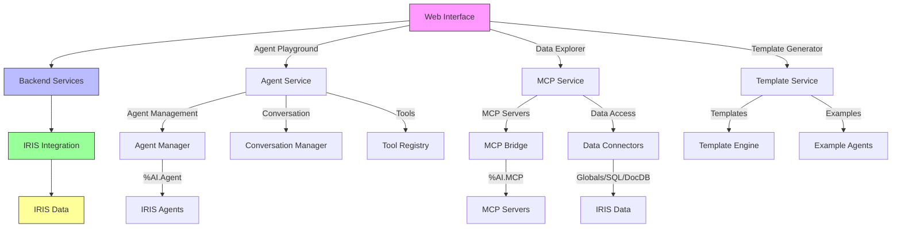

# 🎯 IRIS AI Hub Studio - Project Goals & Vision

**Project**: IRIS AI Hub Studio  
**Bounty Program**: Round 2 - "Idea to Application"  
**Target Points**: 10,000+ (Tier 2 Rewards)  
**Deadline**: August 31, 2026  
**Status**: Planning Phase Complete ✅

---

## 🌟 Project Vision

**IRIS AI Hub Studio** is a **unified, production-ready platform** that combines all three selected bounty ideas into one cohesive AI development environment for InterSystems IRIS.

### The Problem We're Solving

Currently, developers working with AI Hub in IRIS face several challenges:

1. **No Unified Interface**: Different tools for agent testing, data exposure, and starter templates
2. **Complex Setup**: Multiple steps required to get started with AI development
3. **Limited Discovery**: Difficult to find and test available %AI.Agent classes
4. **Manual Integration**: MCP data exposure requires custom implementation each time
5. **Steep Learning Curve**: No beginner-friendly starter templates

### Our Solution

**IRIS AI Hub Studio** provides:

✅ **Single Web Interface**: One place to develop, test, and deploy AI agents
✅ **Agent Playground**: Chat interface for testing any %AI.Agent class
✅ **Data Explorer**: Browse and test MCP-exposed IRIS data sources
✅ **Template Generator**: Create new agents from pre-built templates
✅ **Docker Integration**: Complete docker-compose setup for easy deployment
✅ **Production Ready**: Built with security, performance, and reliability

---

## 🎯 Project Goals

### Primary Goal

**Build a unified platform that qualifies for all three bounty ideas:**

| Idea | Points | Status |
|------|--------|--------|
| Generic Agent Test UI for %AI.Agent | 4,000 | ✅ Included |
| MCP Data Exposure Toolkit | 3,000 | ✅ Included |
| My First Agent (End-To-End Starter) | 3,000 | ✅ Included |
| **Total** | **10,000** | ✅ **Tier 2 Eligible** |

### Secondary Goals

1. **Win Tier 2 Rewards**: Implement all ideas to unlock maximum rewards
2. **Production Quality**: Build something that can be used in real projects
3. **Community Value**: Create tools that help other IRIS developers
4. **Learning Resource**: Provide comprehensive documentation and examples
5. **Extensible Architecture**: Design for future growth and customization

---

## 🏆 Bounty Program Requirements

### Submission Rules

- ✅ **One author only**: Pietro Dileo
- ✅ **New applications**: No reposts of existing work
- ✅ **Open source**: Published on GitHub
- ✅ **README in English**: With installation steps and demo
- ✅ **Fully functional**: End-to-end working applications
- ✅ **Works on IRIS**: Community, Health, or Cloud SQL

### Application Requirements

Each submission must:

1. **Implement the idea completely**
2. **Be fully functional** - Do something useful end-to-end
3. **Work on IRIS** - Tested on community edition
4. **Be open source** - MIT or Apache 2.0 license
5. **Have README** - With installation and usage instructions
6. **Include demo** - Video or written description

### Quality Criteria

- **Creativity and originality** of approach
- **Production readiness** and robustness
- **Documentation quality** and completeness
- **User experience** and ease of use
- **Code quality** and best practices

---

## 📋 Implementation Strategy

### Unified Platform Approach

Instead of submitting three separate applications, we're building **one comprehensive platform** that covers all three ideas. This approach:

✅ **Maximizes points** (10,000+ for Tier 2)
✅ **Creates more value** (integrated solution > separate tools)
✅ **Reduces development time** (shared infrastructure)
✅ **Improves user experience** (single interface)
✅ **Demonstrates expertise** (deep understanding of AI Hub)

### Submission Plan

**Primary Submission**: "IRIS AI Hub Studio"
- Covers all three bounty ideas
- Comprehensive documentation
- Production-ready code
- Demo video and screenshots

**Backup Plan**: If needed, we can extract individual components as separate submissions:
- "Generic Agent Test UI"
- "MCP Data Exposure Toolkit" 
- "My First Agent Starter"

---

## 🎨 Platform Architecture

### High-Level Design

```
┌─────────────────────────────────────────────────────────────┐
│                    IRIS AI Hub Studio                          │
├─────────────────────────────────────────────────────────────┤
│                                                                  │
│  ┌─────────────────────────────────────────────────────────┐│
│  │                    Web Interface                            ││
│  │  ┌─────────────┐  ┌─────────────┐  ┌─────────────────┐  ││
│  │  │ Agent       │  │ Data        │  │ Template       │  ││
│  │  │ Playground  │  │ Explorer    │  │ Generator       │  ││
│  │  └─────────────┘  └─────────────┘  └─────────────────┘  ││
│  └─────────────────────────────────────────────────────────┘│
│                                                                  │
│  ┌─────────────────────────────────────────────────────────┐│
│  │                    Backend Services                         ││
│  │  ┌─────────────┐  ┌─────────────┐  ┌─────────────────┐  ││
│  │  │ Agent       │  │ MCP         │  │ Template       │  ││
│  │  │ Service     │  │ Service     │  │ Service        │  ││
│  │  └─────────────┘  └─────────────┘  └─────────────────┘  ││
│  └─────────────────────────────────────────────────────────┘│
│                                                                  │
│  ┌─────────────────────────────────────────────────────────┐│
│  │                    IRIS Integration                          ││
│  │  ┌─────────────┐  ┌─────────────┐  ┌─────────────────┐  ││
│  │  │ Agent       │  │ MCP         │  │ Data          │  ││
│  │  │ Manager     │  │ Bridge      │  │ Connectors    │  ││
│  │  └─────────────┘  └─────────────┘  └─────────────────┘  ││
│  └─────────────────────────────────────────────────────────┘│
│                                                                  │
└─────────────────────────────────────────────────────────────┘
```

### Component Relationships



---

## 🚀 Implementation Roadmap

### Phase 1: Foundation (Week 1 - July 1-7)
**Goal**: Set up infrastructure and create basic functionality

#### Week 1 Tasks

| Day | Task | Priority | Status |
|-----|------|----------|--------|
| 1 | Set up Docker environment with AI Hub | ⭐⭐⭐ | ⬜ |
| 1 | Create project structure and repositories | ⭐⭐⭐ | ⬜ |
| 2 | Implement Agent Manager foundation | ⭐⭐⭐ | ⬜ |
| 2 | Create basic Agent Test UI (frontend) | ⭐⭐⭐ | ⬜ |
| 3 | Implement MCP Bridge foundation | ⭐⭐⭐ | ⬜ |
| 3 | Create basic MCP Toolkit (backend) | ⭐⭐⭐ | ⬜ |
| 4 | Build Template Generator foundation | ⭐⭐ | ⬜ |
| 4 | Create Starter Agent template | ⭐⭐ | ⬜ |
| 5 | Integrate all components | ⭐⭐⭐ | ⬜ |
| 5 | Test basic end-to-end flow | ⭐⭐⭐ | ⬜ |

#### Week 1 Deliverables
- ✅ Docker-compose setup with IRIS AI Hub
- ✅ Basic Agent Test UI (can select and chat with agents)
- ✅ Basic MCP Toolkit (can expose global data)
- ✅ Basic Template Generator (can create simple agents)
- ✅ Integrated foundation with all components working together

---

### Phase 2: Core Features (Week 2 - July 8-14)
**Goal**: Implement all major features for each component

#### Week 2 Tasks

| Day | Task | Priority | Status |
|-----|------|----------|--------|
| 8 | Enhance Agent Test UI with tool visualization | ⭐⭐⭐ | ⬜ |
| 8 | Add multi-model support to Agent Test UI | ⭐⭐ | ⬜ |
| 9 | Implement SQL and DocDB connectors for MCP | ⭐⭐⭐ | ⬜ |
| 9 | Add security controls to MCP Toolkit | ⭐⭐⭐ | ⬜ |
| 10 | Create advanced agent templates | ⭐⭐ | ⬜ |
| 10 | Add tool and skill templates | ⭐⭐ | ⬜ |
| 11 | Implement conversation management | ⭐⭐⭐ | ⬜ |
| 11 | Add state persistence | ⭐⭐⭐ | ⬜ |
| 12 | Create example agents for different domains | ⭐⭐ | ⬜ |
| 12 | Add comprehensive error handling | ⭐⭐⭐ | ⬜ |
| 13 | Implement REST API endpoints | ⭐⭐⭐ | ⬜ |
| 13 | Add WebSocket support for real-time chat | ⭐⭐ | ⬜ |
| 14 | Test all core features | ⭐⭐⭐ | ⬜ |

#### Week 2 Deliverables
- ✅ Full-featured Agent Test UI with all functionality
- ✅ Complete MCP Toolkit with all data connectors
- ✅ Advanced Template Generator with multiple templates
- ✅ REST and WebSocket APIs
- ✅ Conversation management and state persistence
- ✅ Comprehensive error handling

---

### Phase 3: Polish & Integration (Week 3 - July 15-21)
**Goal**: Polish the platform, add advanced features, and ensure everything works together

#### Week 3 Tasks

| Day | Task | Priority | Status |
|-----|------|----------|--------|
| 15 | Add advanced tool execution visualization | ⭐⭐ | ⬜ |
| 15 | Implement agent configuration UI | ⭐⭐ | ⬜ |
| 16 | Add MCP server configuration UI | ⭐⭐ | ⬜ |
| 16 | Implement template customization | ⭐⭐ | ⬜ |
| 17 | Add user authentication and authorization | ⭐⭐⭐ | ⬜ |
| 17 | Implement logging and monitoring | ⭐⭐ | ⬜ |
| 18 | Create comprehensive documentation | ⭐⭐⭐ | ⬜ |
| 18 | Build demo examples and tutorials | ⭐⭐⭐ | ⬜ |
| 19 | Performance optimization | ⭐⭐ | ⬜ |
| 19 | Security audit | ⭐⭐⭐ | ⬜ |
| 20 | Final integration testing | ⭐⭐⭐ | ⬜ |
| 20 | Create demo video | ⭐⭐⭐ | ⬜ |

#### Week 3 Deliverables
- ✅ Polished user interface with all features
- ✅ Advanced configuration options
- ✅ User authentication and authorization
- ✅ Comprehensive documentation
- ✅ Demo video and screenshots
- ✅ Performance-optimized code
- ✅ Security-hardened implementation

---

### Phase 4: Testing & Submission (Week 4 - July 22-28)
**Goal**: Final testing, bug fixing, and submission preparation

#### Week 4 Tasks

| Day | Task | Priority | Status |
|-----|------|----------|--------|
| 22 | End-to-end testing of all features | ⭐⭐⭐ | ⬜ |
| 22 | Cross-browser testing | ⭐⭐ | ⬜ |
| 23 | Performance testing under load | ⭐⭐ | ⬜ |
| 23 | Security penetration testing | ⭐⭐⭐ | ⬜ |
| 24 | Fix critical bugs | ⭐⭐⭐ | ⬜ |
| 24 | Fix minor bugs and polish | ⭐⭐ | ⬜ |
| 25 | Final documentation review | ⭐⭐⭐ | ⬜ |
| 25 | Create README with installation guide | ⭐⭐⭐ | ⬜ |
| 26 | Prepare Open Exchange submission | ⭐⭐⭐ | ⬜ |
| 26 | Create submission materials | ⭐⭐⭐ | ⬜ |
| 27 | Final review and validation | ⭐⭐⭐ | ⬜ |
| 28 | Submit to Open Exchange | ⭐⭐⭐ | ⬜ |

#### Week 4 Deliverables
- ✅ Fully tested and validated platform
- ✅ Bug-free code (as much as possible)
- ✅ Complete documentation
- ✅ README with installation and usage
- ✅ Demo video
- ✅ Open Exchange submission

---

### Phase 5: Buffer Week (Week 5 - July 29-31)
**Goal**: Handle any delays, final polish, and ensure timely submission

#### Week 5 Tasks

| Day | Task | Priority | Status |
|-----|------|----------|--------|
| 29 | Address any remaining issues | ⭐⭐⭐ | ⬜ |
| 29 | Final performance optimization | ⭐⭐ | ⬜ |
| 30 | Last-minute polish and improvements | ⭐⭐ | ⬜ |
| 30 | Final documentation updates | ⭐⭐ | ⬜ |
| 31 | Final submission validation | ⭐⭐⭐ | ⬜ |
| 31 | **SUBMISSION DEADLINE** | ⭐⭐⭐ | ⬜ |

#### Week 5 Deliverables
- ✅ All issues resolved
- ✅ Final polish applied
- ✅ Documentation complete
- ✅ **Submission completed by deadline**

---

## 📊 Milestone Summary

| Phase | Duration | Goal | Key Deliverables |
|-------|----------|------|------------------|
| 1 | Week 1 | Foundation | Basic functionality for all components |
| 2 | Week 2 | Core Features | All major features implemented |
| 3 | Week 3 | Polish | Advanced features, UI polish, docs |
| 4 | Week 4 | Testing | Testing, bug fixing, submission prep |
| 5 | Week 5 | Buffer | Final polish, submission |

---

## 🎯 Component-Specific Roadmaps

### 1. Generic Agent Test UI

#### Week 1: Foundation
- [ ] Set up React frontend with TypeScript
- [ ] Create basic layout and navigation
- [ ] Implement agent discovery API
- [ ] Build agent selector component
- [ ] Create basic chat interface
- [ ] Connect to backend agent service

#### Week 2: Core Features
- [ ] Add conversation management
- [ ] Implement tool execution display
- [ ] Add model selection support
- [ ] Create agent configuration panel
- [ ] Add markdown rendering for responses
- [ ] Implement loading states and error handling

#### Week 3: Polish
- [ ] Add syntax highlighting for code in responses
- [ ] Implement conversation history
- [ ] Add export/import conversations
- [ ] Create agent comparison feature
- [ ] Add keyboard shortcuts
- [ ] Implement responsive design

#### Week 4: Testing
- [ ] Test with multiple agent classes
- [ ] Test with different models
- [ ] Test tool execution edge cases
- [ ] Test error scenarios
- [ ] Performance testing

---

### 2. MCP Data Exposure Toolkit

#### Week 1: Foundation
- [ ] Set up MCP server framework
- [ ] Create basic global connector
- [ ] Implement MCP resource listing
- [ ] Build basic data exposure API
- [ ] Create simple frontend for data browsing

#### Week 2: Core Features
- [ ] Implement SQL connector
- [ ] Implement DocDB connector
- [ ] Add security and access control
- [ ] Create template system for connectors
- [ ] Implement data query capabilities
- [ ] Add data transformation options

#### Week 3: Polish
- [ ] Create advanced security templates
- [ ] Add data validation
- [ ] Implement caching for frequent queries
- [ ] Add performance monitoring
- [ ] Create example configurations
- [ ] Build comprehensive UI for data exploration

#### Week 4: Testing
- [ ] Test with various data formats
- [ ] Test security controls
- [ ] Test performance with large datasets
- [ ] Test error handling
- [ ] Validate all templates

---

### 3. My First Agent (Starter Template)

#### Week 1: Foundation
- [ ] Create basic agent template
- [ ] Set up docker-compose structure
- [ ] Implement basic tool examples
- [ ] Create simple skill examples
- [ ] Build configuration system

#### Week 2: Core Features
- [ ] Add multiple agent templates (healthcare, finance, etc.)
- [ ] Implement MCP integration in templates
- [ ] Add sub-agent examples
- [ ] Create multi-model configuration
- [ ] Add comprehensive documentation

#### Week 3: Polish
- [ ] Create interactive template generator UI
- [ ] Add template customization options
- [ ] Implement template validation
- [ ] Add example projects
- [ ] Create tutorial walkthroughs

#### Week 4: Testing
- [ ] Test all templates
- [ ] Validate docker-compose setups
- [ ] Test with different IRIS versions
- [ ] Verify all examples work
- [ ] Test documentation completeness

---

## 📅 Detailed Timeline with Dates

### July 2026

| Date | Day | Phase | Tasks |
|------|-----|-------|-------|
| Jul 1 | Tue | Phase 1 | Docker setup, project structure |
| Jul 2 | Wed | Phase 1 | Agent Manager, basic Agent Test UI |
| Jul 3 | Thu | Phase 1 | MCP Bridge, basic MCP Toolkit |
| Jul 4 | Fri | Phase 1 | Template Generator, Starter Agent |
| Jul 5 | Sat | Phase 1 | Integration, testing |
| Jul 6 | Sun | Phase 1 | Buffer / catch-up |
| Jul 7 | Mon | Phase 1 | **Phase 1 Complete** ✅ |
| Jul 8 | Tue | Phase 2 | Enhanced Agent Test UI |
| Jul 9 | Wed | Phase 2 | SQL/DocDB connectors, security |
| Jul 10 | Thu | Phase 2 | Advanced templates |
| Jul 11 | Fri | Phase 2 | Conversation management |
| Jul 12 | Sat | Phase 2 | REST/WebSocket APIs |
| Jul 13 | Sun | Phase 2 | Testing |
| Jul 14 | Mon | Phase 2 | **Phase 2 Complete** ✅ |
| Jul 15 | Tue | Phase 3 | Advanced UI features |
| Jul 16 | Wed | Phase 3 | Configuration UIs |
| Jul 17 | Thu | Phase 3 | Authentication, logging |
| Jul 18 | Fri | Phase 3 | Documentation, demos |
| Jul 19 | Sat | Phase 3 | Performance optimization |
| Jul 20 | Sun | Phase 3 | **Phase 3 Complete** ✅ |
| Jul 21 | Mon | Phase 3 | Buffer / catch-up |
| Jul 22 | Tue | Phase 4 | End-to-end testing |
| Jul 23 | Wed | Phase 4 | Performance/security testing |
| Jul 24 | Thu | Phase 4 | Bug fixing |
| Jul 25 | Fri | Phase 4 | Documentation review |
| Jul 26 | Sat | Phase 4 | Submission preparation |
| Jul 27 | Sun | Phase 4 | Final validation |
| Jul 28 | Mon | Phase 4 | **Phase 4 Complete** ✅ |
| Jul 29 | Tue | Phase 5 | Final polish |
| Jul 30 | Wed | Phase 5 | Last-minute improvements |
| Jul 31 | Thu | Phase 5 | **SUBMISSION DEADLINE** 🎯 |

---

## 🎯 Success Criteria

### For the Project

- [ ] **All three bounty ideas implemented** in one unified platform
- [ ] **10,000+ points** earned (Tier 2 rewards unlocked)
- [ ] **Production-ready code** with proper error handling
- [ ] **Comprehensive documentation** with examples
- [ ] **Demo video** showing all features
- [ ] **Open Exchange submission** completed by deadline

### For Each Component

#### Generic Agent Test UI
- [ ] Can discover and list all %AI.Agent classes
- [ ] Can select any agent and start chatting
- [ ] Displays tool execution with inputs and outputs
- [ ] Supports multi-model selection
- [ ] Shows conversation history
- [ ] Handles errors gracefully

#### MCP Data Exposure Toolkit
- [ ] Can expose global data via MCP
- [ ] Can expose SQL tables via MCP
- [ ] Can expose DocDB collections via MCP
- [ ] Provides security controls for data access
- [ ] Includes reusable templates
- [ ] Has example configurations

#### My First Agent (Starter)
- [ ] Provides multiple agent templates
- [ ] Includes docker-compose setup
- [ ] Demonstrates tool usage
- [ ] Demonstrates skill usage
- [ ] Demonstrates MCP integration
- [ ] Has comprehensive documentation

---

## 🏆 Reward Structure

### Points Breakdown

| Component | Points | Status |
|-----------|--------|--------|
| Generic Agent Test UI | 4,000 | Target ✅ |
| MCP Data Exposure Toolkit | 3,000 | Target ✅ |
| My First Agent Starter | 3,000 | Target ✅ |
| **Total** | **10,000** | **Tier 2 Unlocked** 🎯 |

### Tier 2 Rewards
- ✅ **Credly badge** for each qualifying submission
- ✅ **Global Masters badge** 
- ✅ **10,000+ Global Masters points**
- ✅ **Tier 2 rewards** (exact rewards TBD by InterSystems)

### Additional Benefits
- ✅ **Community recognition**
- ✅ **Portfolio piece** for future opportunities
- ✅ **Production-ready tool** for your own projects
- ✅ **Learning experience** with AI Hub and IRIS

---

## 📝 Project Manifesto

### Why We're Building This

1. **Solve a Real Problem**: Developers need better tools for AI development in IRIS
2. **Win the Bounty**: Earn points and recognition in the InterSystems community
3. **Learn and Grow**: Master AI Hub, MCP, and modern IRIS development
4. **Give Back**: Create value for the InterSystems community
5. **Build for the Future**: Create tools we can use in future projects

### Our Commitment

- **Quality First**: We'll build production-ready code, not just bounty submissions
- **Document Everything**: Comprehensive docs so others can use and learn from our work
- **Test Thoroughly**: Every feature will be tested before submission
- **Meet Deadlines**: We'll submit on time, every time
- **Have Fun**: This is a learning experience - enjoy the process!

### Success Definition

**We succeed when:**
1. We submit a working platform by August 31, 2026
2. The platform earns 10,000+ points
3. The platform is actually useful for developers
4. We learn new skills and technologies
5. We have fun building something great

---

## 🚀 Next Steps

### Immediate Actions (This Week)

1. **✅ Set up development environment** (Docker, IRIS, AI Hub)
2. **✅ Review and approve this roadmap**
3. **✅ Create GitHub repository** for the project
4. **✅ Set up project structure** based on architecture
5. **✅ Begin Phase 1 implementation**

### This Week's Focus

- [ ] Complete Docker setup (use `docs/DOCKER-SETUP.md`)
- [ ] Verify AI Hub installation
- [ ] Create GitHub repository
- [ ] Set up project structure
- [ ] Start with Agent Manager foundation

---

## 📚 Resources

### Documentation
- [AI Hub Official Documentation](../generic/AI-HUB-OFFICIAL-DOCUMENTATION.md)
- [AI Hub Quick Reference](../generic/AI-HUB-QUICK-REFERENCE.md)
- [Docker Setup Guide](../DOCKER-SETUP.md)

### Development Tools
- Docker and docker-compose
- IRIS Community Edition with AI Hub
- Node.js and npm/yarn
- React for frontend
- VS Code with ObjectScript extension

### Community Resources
- [InterSystems Developer Community](https://community.intersystems.com/)
- [Open Exchange](https://openexchange.intersystems.com/)
- [AI Hub GitHub](https://github.com/intersystems-community/ai-hub-eap)

---

**Document Information**
- **Version**: 1.0
- **Purpose**: Project goals, vision, and implementation roadmap
- **Status**: Approved and Ready for Execution
- **Author**: Pietro Dileo (with AI Assistant)
- **Last Updated**: July 2026
- **Next Review**: Weekly during development

---

## 🎉 Let's Get Started!

**The roadmap is set. The plan is clear. Now it's time to build!**

### Week 1 Kickoff

1. **Today**: Set up Docker environment
2. **Tomorrow**: Verify AI Hub and start coding
3. **This Week**: Complete Phase 1 (Foundation)

**Ready to begin?** Let's start with the Docker setup and then move on to implementing the Agent Manager! 🚀